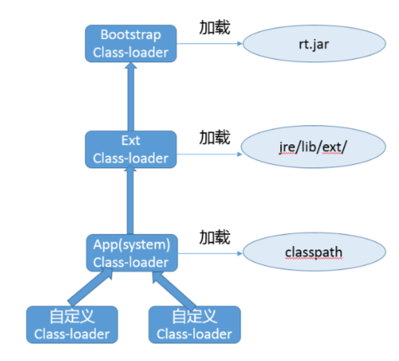
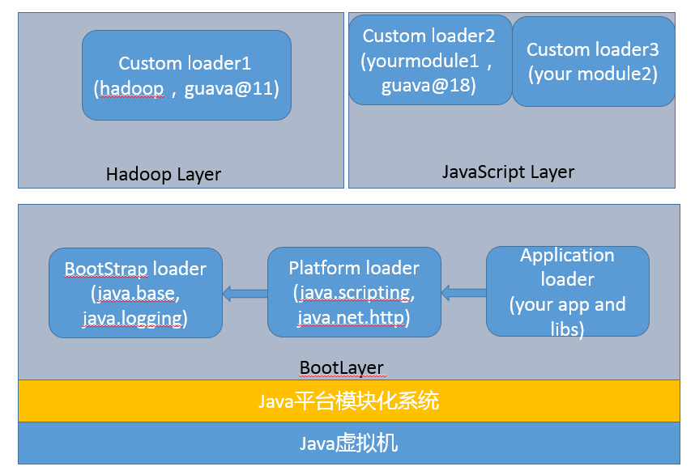
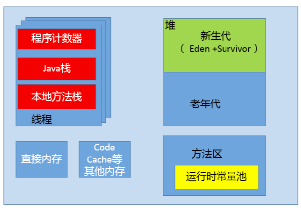
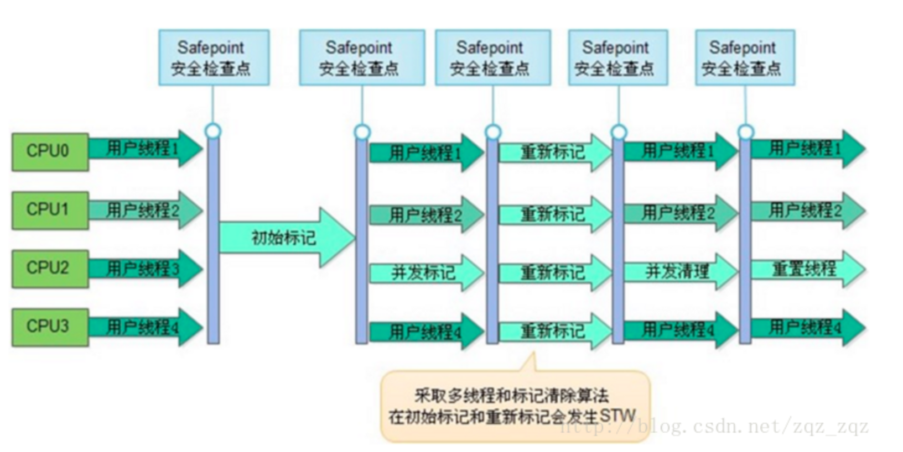
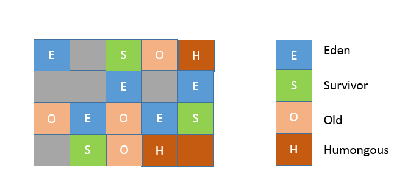
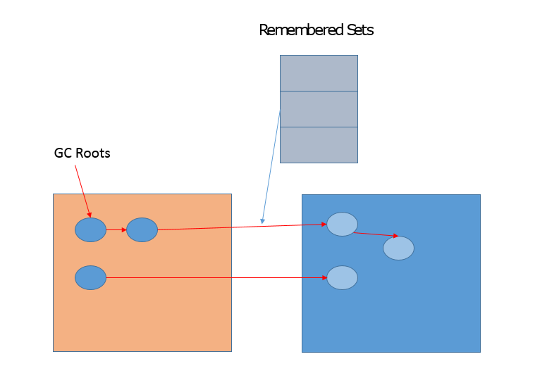
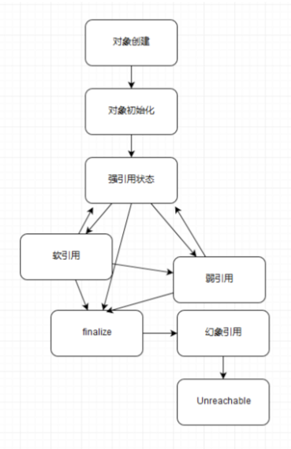

[toc]

 <div style="page-break-after: always;"></div>
# Java基础

## 类加载器



### 启动类加载器（Bootstrap classloader）

1. 加载 jre/lib 下面的 jar 文件，如 rt.jar。它是个超级公民，即使是在开启了 Security Manager 的时候，JDK 仍赋予了它加载的程 序 AllPermission。它是JVM中唯一一个使用c++写的类加载器，JVM启动时首先运行的类加载器。

   1. 有的时候可能不得不去试图修改 JDK 的基础代码，也就是通常 意义上的核心类库，我们可以使用下面的命令行参数。

      ```shell
      # 指定新的 bootclasspath，替换 java.* 包的内部实现
      java -Xbootclasspath:<your_boot_classpath> your_App
      
      # a 意味着 append，将指定目录添加到 bootclasspath 后面
      java -Xbootclasspath/a:<your_dir> your_App
      
      # p 意味着 prepend，将指定目录添加到 bootclasspath 前面
      java -Xbootclasspath/p:<your_dir> your_App
      ```

   2. 使用最常见的 “/p”，既然是前置，就有机会替换个别基础类的实现。

2. 我们一般可以使用下面方法获取父加载器，但是在通常的 JDK/JRE 实现中，扩展类加载器 getParent() 都只能返回 null。

   ```java
   public final ClassLoader getParent()
   ```

   如果返回null，则说明它的父类加载器就是bootstrap类加载器，这是因为其他的类加载器都是使用java编写的，只有bootstrap类加载器是c++编写的，java中的类不能直接引用c++的类。

### 扩展类加载器（Extension or Ext Class-Loader）

1. 负责加载我们放到 jre/lib/ext/ 目录 下面的 jar 包，这就是所谓的 extension 机制。

2. 该目录也可以通过设置 “java.ext.dirs”来覆盖。

   ```shell
   java -Djava.ext.dirs=your_ext_dir HelloWorld
   ```

### 应用类加载器（Application or App Class-Loader）

1. 加载我们最熟悉的 classpath 的内容。

2. 这里有一个容易混淆的概念，系统(System)类加载器，通常来说，其默认就是 JDK 内建的应用类加载器，但是它同样是可能修改的，比如:

   ```shell
   java -Djava.system.class.loader=com.yourcorp.YourClassLoader HelloWorld
   ```

   如果我们指定了这个参数，JDK 内建的应用类加载器就会成为定制加载器的父亲，这种方式通常用在类似需要改变双亲委派模式的场景。

### Java9中的变化

1. 前面提到的 -Xbootclasspath 参数不可用了。API 已经被划分到具体的模块，所以上文中，利用“-Xbootclasspath/p”替换某个 Java 核心类型代码，实际上变成了对相应的模块进行的修补，可以采用下面的解决方案:

   1. 首先，确认要修改的类文件已经编译好，并按照对应模块(假设是 java.base)结构存放，

   2. 然后，给模块打补丁:

      ```shell
      java --patch-module java.base=your_patch yourApp
      ```

2. 扩展类加载器被重命名为平台类加载器(Platform Class-Loader), 而且 extension 机制则被移除。

   1. 也就意味着，如果我们指定 java.ext.dirs 环境变量，或者 lib/ext 目录存 在，JVM 将直接返回**错误**!建议解决办法就是将其放入 classpath 里。

3. 部分不需要 AllPermission 的 Java 基础模块，被降级到平台类加载器中，相应的权限也 被更精细粒度地限制起来。

4. rt.jar 和 tools.jar 同样是被移除了

   1. JDK 的核心类库以及相关资源，被存储在 jimage 文 件中，并通过新的 JRT 文件系统访问，而不是原有的 JAR 文件系统。虽然看起来很惊 人，但幸好对于大部分软件的兼容性影响，其实是有限的，更直接地影响是 IDE 等软 件，通常只要升级到新版本就可以了。

5. 增加了 Layer 的抽象， JVM 启动默认创建 BootLayer，开发者也可以自己去定义和实例化 Layer，可以更加方便的实现类似容器一般的逻辑抽象。

   1. 结合了 Layer，目前的 JVM 内部结构就变成了下面的层次，内建类加载器都在 BootLayer 中，其他 Layer 内部有自定义的类加载器，不同版本模块可以同时工作在不同的 Layer。

    

### 如何降低类加载开销

1. AOT

   1. 直接编译成机器码，降低的其实主要是解释和编译开销。但是其目前还是个试验特性，支持的平台也有限，

2. AppCDS(Application Class-Data Sharing)

   1. CDS 在 Java 5 中被引进，但仅限于 Bootstrap Class-loader，在 8u40 中实现了 AppCDS，支持其他的类加载器，在目前 2018 年初发布的 JDK 10 中已经开源。

   2. 工作原理

      1. JVM 将类信息加载， 解析成为元数据，并根据是否需要修改，将其分类为 Read- Only 部分和 Read-Write 部分

      2. 然后，将这些元数据直接存储在文件系统中，作为所谓的 Shared Archive。命令很简单:

         ```shell
         java -Xshare:dump -XX:+UseAppCDS -XX:SharedArchiveFile=<jsa>  \
                  -XX:SharedClassListFile=<classlist> -XX:SharedArchiveConfigFile=<config_file>
         ```

      3. 在应用程序启动时，指定归档文件，并开启 AppCDS。

         ```shell
         Java -Xshare:on -XX:+UseAppCDS -XX:SharedArchiveFile=<jsa> yourApp
         ```

         通过上面的命令，JVM 会通过内存映射技术，直接映射到相应的地址空间，免除了类加载、解析等各种开销。

## 类加载器的三个特征

1. 双亲委派模型
   1. 但不是所有类加载都遵守这个模型，有的时候，启动类加载器所加载的类型，是可能要加载用户代码的，比如 JDK 内部的 ServiceProvider/ServiceLoader机 制，用户可以在标准 API 框架上，提供自己的实现，JDK 也需要提供些默认的参考实 现。 例如，Java 中 JNDI、JDBC、文件系统、Cipher 等很多方面，都是利用的这种机制，这种情况就不会用双亲委派模型去加载，而是利用所谓的上下文加载器。
2. 可见性
   1. 子类加载器可以访问父加载器加载的类型，但是反过来是不允许的，不然，因为缺少必要的隔离，我们就没有办法利用类加载器去实现容器的逻辑。
3. 单一性
   1. 由于父加载器的类型对于子加载器是可见的，所以父加载器中加载过的类型，就不会在子加载器中重复加载。但是注意，类加载器“邻居”间，同一类型仍然可以被加载多次，因为互相并不可见。

## JVM内存区域划分   



这里的主要内存区如上图所以，不在做特别的描述，只把其中的几个我认为比较重要的单独说一下

### 方法区

1. 线程共享的一块内存区域， 用于存储所谓的元(Meta)数据，例如类结构信息，以及对应的运行时常量池、字段、方法代码等。 
2. java8之前叫做永久代(Permanent Generation)。Oracle JDK 8 中将永久代移除，同时增加了元数据区(Metaspace)。 
   1. 对于老版本的 Oracle JDK，因为永久代的大小是有限的，并且 JVM 对永久代垃圾回收 (如，常量池回收、卸载不再需要的类型)非常不积极，所以当我们不断添加新类型的时候，永久代出现 OutOfMemoryError 也非常多见，
   2. 尤其是在运行时存在大量动态类型生成的场合;类似 Intern 字符串缓存占用太多空间，也会导致 OOM问题。
   3. 对应的异常信息，会标记出来和永久代相关:“java.lang.OutOfMemoryError: PermGen space”。 
   4. 随着元数据区的引入，方法区内存已经不再那么窘迫，所以相应的 OOM 有所改观，出现 OOM，异常信息则变成了:“java.lang.OutOfMemoryError: Metaspace”。 

### 运行时常量池  

1. 方法区的一部分
2. 不见包含各种字面量，还有在运行时决定的符号引用

### 本地方法栈

1. 每个线程都会创建一个 
2. 本地方法栈和 Java 虚拟机栈是在同一块儿区域，这完全取决于技术实现的决定，并未在规范中强制。 

## 容器中的JVM

其实主要问题就是，

1. JVM错误判断了可获取的 CPU 资源，例如，Docker 限制了 CPU 的核数，JVM 就可能设置不合适的 GC 并行线程数等。
2. 未配置合适的 JVM 堆和元数据区、直接内存等参数，Java 就有可能试图使用超过容 器限制的内存，最终被容器 OOM kill，或者自身发生 OOM。
3. namespace 对于容器内的应用细节增加了一些微妙的差异，比如 jcmd、jstack 等 工具会依赖于“/proc/”下面提供的部分信息，但是 Docker 的设计改变了这部分信息的原有结构，我们需要对原有工具进行修改以适应这种变化。

### JVM Ergonomics

1. JVM 会大概根据检测到的内存大小，设置最初启动时的堆大小为系统内存的 1/64; 并将堆最大值，设置为系统内存的 1/4
2. JVM 检测到系统的 CPU 核数，则直接影响到了 Parallel GC 的并行线程数目和 JIT complier 线程数目，甚至是我们应用中 ForkJoinPool 等机制的并行等级。
   1. 这些判断在非容器环境下是ok的，但是如果在容器环境下，由于容器有可能限制了CPU核心数，比如说，容器限制了使用8核心，但是硬件平台确有32核心，如果不加配置，那么JVM默认就会检测到32核心，从而使用32线程的Parallel GC。
3. 更加严重的是，JVM 的一些原有诊断或备用机制也会受到影响。为保证服务的可用性，一种常见的选择是依赖“-XX:OnOutOfMemoryError”功能，通过调用处理脚本的形式来做一些补救措施，比如自动重启服务等。但是，这种机制是基于 fork 实现的，当 Java 进程已经过度提交内存时，fork 新的进程往往已经不可能正常运行了。

### 应对策略

1. java 9 or **java 8u131**以后的版本

   1. java9引入了以下JVM参数，并且backport到了**java 8u131**及其以后的版本中

      ```shell
      -XX:+UnlockExperimentalVMOptions
      -XX:+UseCGroupMemoryLimitForHeap
      ```

      **这两个参数是顺序敏感的, 只支持Linux**

2. Java 10 及以后的版本

   1. 增加了相应的容器化支持，默认就会自适应各种资源限制和实现差异

   2. 前面提到的实验性参数“UseCGroupMemoryLimitForHeap”已经被标记为废弃。

   3. 新增了参数用以明确指定 CPU 核心的数目

      ```shell
      -XX:ActiveProcessorCount=N
      ```

   4. 如果实践中发现有问题，也可以使用“-XX:-UseContainerSupport”，关闭 Java 的容器支持特性，这可以作为一种防御性机制，避免新特性破坏原有基础功能。

3. **Java 8u131**以前及更老的版本

   1. 直接指定 JVM 堆大小

      ```shell
      -e JAVA_OPTIONS='-Xmx300m'
      ```

   2. 明确配置 GC 和 JIT 并行线程数目，以避免二者占用过多计算资源

      ```shell
      -XX:ParallelGCThreads
      -XX:CICompilerCount
      ```

   3. 明确告知 JVM 系统内存限额

      ```shell
      -XX:MaxRAM=`cat /sys/fs/cgroup/memory/memory.limit_in_bytes`
      ```

   4. 禁用swap，docker参数如下

      ```shell
      --memory-swappiness=0
      ```

## 垃圾回收器（GC collector）

### 分类

1. Serial GC

   1. 顾名思义 ，串行GC
   2. 用户新生代
   3. -XX:+UseSerialGC

2. Serial Old

   1. 应用于老年代，当然也是串行
   2. 它采用了标记 - 整理(Mark- Compact)算法

3. ParNew GC

   1. 新生代GC，Serial GC的多线程版本

   2. 最常见的是配合CMS工作，所以要指定两个JVM参数

      ```shell
      -XX:+UseConcMarkSweepGC -XX:+UseParNewGC
      ```

4. CMS(Concurrent Mark Sweep) GC

   1. 基于标记 - 清除(Mark-Sweep)算法
   2. 设计目标是尽量减少停顿时间
   3. 缺点
      1. 强调了并发(Concurrent)，CMS 会占用更多 CPU 资源，并和用户线程争抢。
      2. CMS 采用的标记 - 清除算法，存在着内存碎 片化问题，所以难以避免在长时间运行等情况下发生 full GC，导致恶劣的停顿
      3. 另外对于堆设置的比较大的应用，CMS的stop-the-world时间会比较长

5. Parrallel GC

   1. 也被称作是吞吐量优先的 GC

   2. 它的算法和 Serial GC 比较相似，尽管实现要复杂的多

   3. 其特点是新生代和老年代 GC 都是并行进行的，在常见的服务器环境中更加高效

   4. 开启选项是

      ```shell
      -XX:+UseParallelGC
      ```

   5. Parallel GC 引入了开发者友好的配置项，我们可以直接设置暂停时间或吞吐量等目 标，JVM 会自动进行适应性调整，例如下面参数

      ```shell
      -XX:MaxGCPauseMillis=value
      -XX:GCTimeRatio=N // GC 时间和用户时间比例 = 1 / (N+1)
      ```

6. G1 GC

   1. 一种兼顾吞吐量和停顿时间的 GC 实现
   2. Region 之间是复制算法，但整体上实际可看作是标记 - 整理 (Mark-Compact)算法，可以有效地避免内存碎片，尤其是当 Java 堆非常大的时候， G1 的优势更加明显。

### 垃圾收集的原理和基础概念

#### 基本算法

1. 引用计数算法
2. 垃圾收集
   1. 追踪性垃圾收集(Tracing Garbage Collection)
   2. 通过GC roots来判断对象的可达性，有的地方也叫可达性分析

#### 垃圾收集算法的主要思路

1. 复制(Copying)算法
   1. 主要用作新生代，在eden和survivor区中做可达对象的拷贝
   2. 缺点
      1. 既然要进行复制，既要提前预留内存空间，有一定的浪费
      2. 对于 G1 这种分拆成为大量 region 的 GC，复制而不是移动，意味着 GC 需要维护 region 之 间对象引用关系，这个开销也不小，不管是内存占用或者时间开销。
2. 标记 - 清除(Mark-Sweep)算法
   1. 不可避免的出现碎片化问 题，这就导致其不适合特别大的堆
3. 标记 - 整理(Mark-Compact)算法
   1. 类似于标记 - 清除，但为避免内存碎片化，它会在清 理过程中将对象移动，以确保移动后的对象占用连续的内存空间。

#### 堆内存的回收

当前的JVM使用的就是可达性分型，而python使用的引用计数和垃圾收集并用的算法

#### 方法区的回收

1. 一般来说初始化类加载器加载的类型是不会进行类卸载(unload)的

2. 而普通的类型的卸载， 往往是要求相应自定义类加载器本身被回收，所以大量使用动态类型的场合，需要防止元数据区(或者早期的永久代)不会 OOM。

   1. spring就是这种大量使用动态类型的场合，需要特别注意

   2. **8u40**中加入了以下参数

      ```shell
      -XX:+ClassUnloadingWithConcurrentMark
      ```

### GC通用参数配置

```shell
-XX:+PrintGCDetails
-XX:+PrintGCDateStamps
-XX:+PrintAdaptiveSizePolicy // 打印 G1 Ergonomics 相关信息
```

1. 我们知道 GC 内部一些行为是适应性的触发的，利用 PrintAdaptiveSizePolicy，我们就可以知道为什么 JVM 做出了一些可能我们不希望发生的动作。例如，G1 调优的一个基本建议就是避免进行大量的 Humongous 对象分配，如果 Ergonomics 信息说明发生了这一点，那么就可以考虑要么增大堆的大小，要么直接将 region 大小提高。

2. 如果是怀疑出现引用清理不及时的情况，则可以打开下面选项，掌握到底是哪里出现了堆积。

   ```shell
   -XX:+PrintReferenceGC
   -XX:+ParallelRefProcEnabled
   ```

需要注意的一点是，JDK 9 中 JVM 和 GC 日志机构进行了重构，其实我前面提到的**PrintGCDetails 已经被标记为废弃**，而**PrintGCDateStamps 已经被移除**，指定它会导致 JVM 无法启动。可以使用下面的命令查询新的配置参数。

```shell
java -Xlog:help
```

### CMS

鉴于CMS在JVM中的特殊地位，把它单拉出来了

上面说了，CMS采用的是标记-清除算法，不会对内存进行compact，那么我们如何应对内存碎片呢？

#### CMS 七个步骤

1. 初始标记(CMS-initial-mark) ,**会导致stw**;

2. 并发标记(CMS-concurrent-mark)，与用户线程同时运行；

3. 预清理（CMS-concurrent-preclean），与用户线程同时运行；

4. 可被终止的预清理（CMS-concurrent-abortable-preclean） 与用户线程同时运行；

5. 重新标记(CMS-remark) ，**会导致stw**；

6. 并发清除(CMS-concurrent-sweep)，与用户线程同时运行；

7. 并发重置状态等待下次CMS的触发(CMS-concurrent-reset)，与用户线程同时运行；



#### 可优化的点

1. 在重新标记阶段，CMS会扫描整个堆
   1. 为什么要扫描正在堆？包括新生代呢？
   2. 主要原因是因为，如果新生代对象引用了老年代对象，那么这些对象仍然被认为是存活对象
   3. 即使这些新生代对象已经不可达了，如果这个时候只扫描老年代的话，那么这些新生代对象仍然会当做GC roots来扫描，赵成耗时比较长
   4. 如何消除上面的扫描耗时
      1. **-XX:+CMSScavengeBeforeRemark**
         1. 在重新标记之前，先执行一次ygc，回收掉年轻带的对象无用的对象，并将对象放入幸存带或晋升到老年代，

2. 内存碎片
   1. 应对方法就是用`-XX:CMSFullGCsBeforeCompaction=n `, 意思是说在上一次CMS并发GC执行过后，到底还要再执行多少次full GC才会做压缩
   2. 默认是0，也就是在默认配置下每次CMS GC顶不住了而要转入full GC的时候都会做压缩。
   3. 如果把CMSFullGCsBeforeCompaction配置为10，就会让上面说的第一个条件变成每隔10次真正的full GC才做一次压缩。

3. concurrent mode failure

   1. 主要原因就是，在做ygc的时候，需要把对象放到老年代，这个时候老年代没有空间了

   2. 为什么叫concurrent mode，主要是因为cms的并发标记阶段，gc线程跟用户线程是同时在跑的，同时就是concurrent了

   3. 因此CMS收集器不能像其他收集器那样等到老年代几乎完全被填满了再进行收集，需要预留一部分空间提供并发收集时的程序运作使用

      ```shell
      -XX:+UseCMSInitiatingOccupancyOnly
      -XX:CMSInitiatingOccupancyFraction=70
      ```

      1. 设定CMS在对内存占用率达到70%的时候开始GC
      2. 这样就预留出来一些空间给GC使用
      3. 这两个参数要一起设置，如果-XX:+UseCMSInitiatingOccupancyOnly不指定，JVM仅在第一次使用设定值,后续则自动调整会导致上面的那个参数不起作用。

### G1GC

从内存区域的角度，G1 同样存在着年代的概念，但是与我前面介绍的内存结构很不一样， 其内部是类似棋盘状的一个个 region 组成，请参考下面的示意图。

 

1. Region的大小

   region 的大小是一致的，数值是在 1M 到 32M 字节之间的一个 2 的幂值数，JVM 会尽量 划分 2048 个左右、同等大小的 region，这点可以从源码heapRegionBounds.hpp中看 到。当然这个数字既可以手动调整，G1 也会根据堆大小自动进行调整。

2. Humongous

   G1 会将超过 region 50% 大小的对象(在应 用中，通常是 byte 或 char 数组)归类为 Humongous 对象，

3. region的副作用

   1. region 大小和大对象很难保证一致，这会导致空间的浪费。不知道你有没有注意到，示意图中有的区域是 Humongous 颜色，但没有用名称标记，这是为了表示，特别大的对象是可能占用超过一个 region 的。并且，region 太小不合适，会令你在分配大对象时更难找到连续空间，这是一个长久存在的情况，

   2. 解决方法，就是直接指定region的大小

      ```shell
      -XX:G1HeapRegionSize=<N, 例如 16>M
      ```

#### 算法

1. 在新生代，G1 采用的仍然是并行的复制算法，所以同样会发生 Stop-The-World 的暂 停。

2. 在老年代，大部分情况下都是并发标记，而整理(Compact)则是和新生代 GC 时捎带进行，并且不是整体性的整理，而是增量进行的。

   1. 依靠 Mixed GC。并发标记结束后，JVM 就有足够的信息进行垃圾收集，Mixed GC 不仅同时会清理 Eden、Survivor 区域，而且还会清理部分 Old 区域。 可以通过设置下面的参数，指定触发阈值，并且设定最多被包含在一次 Mixed GC 中的 region 比例。

      ```shell
      –XX:G1MixedGCLiveThresholdPercent
      –XX:G1OldCSetRegionThresholdPercent
      ```

#### RSet

1. Remembered Set，用于记录和维护 region 之间对象的引用关系。为什么需要这么做呢?试想，新生代 GC 是复制算法，也就是说，类似对象从 Eden 或者 Survivor 到 to 区域的“移动”，其实是“复制”，本质上是一个新的对象。在这个过程中，需要必须保证老年代到新生代的跨区引用仍然有效。

 

G1 的很多开销都是源自 Remembered Set，例如，它通常约占用 Heap 大小的 20% 或更高，这可是非常可观的比例。并且，我们进行对象复制的时候，因为需要扫描和更改 Card Table 的信息，这个速度影响了复制的速度，进而影响暂停时间。

#### G1中的类卸载

1. `-XX:+TraceClassUnloading`使用该参数进行类卸载的跟踪

2. **8u40**以后，G1 增加并默认开启下面的选项， 

   ```shell
   -XX:+ClassUnloadingWithConcurrentMark
   ```

   也就是说，在并发标记阶段结束后，JVM 即进行类型卸载

#### 触发GC的阈值

G1也跟CMS一样，需要应对因为老年代收集不及时而导致的ygc失败的问题，可以使用如下的参数调整

```shell
-XX:InitiatingHeapOccupancyPercent
```

在 JDK 9 之后的 G1 实现中，这种调整需求会少很多，因为 JVM 只会将该参数作为初始 值，会在运行时进行采样，获取统计数据，然后据此动态调整并发标记启动时机。对应的 JVM 参数如下，默认已经开启:

```shell
-XX:+G1UseAdaptiveIHOP
```

#### 实践

1. 如果发现 Young GC 非常耗时，这很可能就是因为新生代太大了，我们可以考虑减小新生代的最小比例。

   ```shell
   -XX:G1NewSizePercent
   -XX:G1MaxNewSizePercent
   ```

2. Mixed GC 延迟较长

   1. 部分 Old region 会被包含进 Mixed GC，减少一次处理的 region 个数，就是个直接的选择之一
   2. G1OldCSetRegionThresholdPercent 控制其最大值
   3. `-XX:G1MixedGCCountTarget`, 默认值是8， Mixed GC 数量增多，意味着每次被包含的 region 减少。

3. [Oracle的G1调优指南](https://docs.oracle.com/javase/9/gctuning/garbage-first-garbage-collector-tuning.htm#JSGCT-GUID-90E30ACA-8040-432E-B3A0-1E0440AB556A)

## 动态代理

### 自己实现一个动态代理

```java
public class MyDynamicProxy {
    public static  void main (String[] args) {
        HelloImpl hello = new HelloImpl();
        MyInvocationHandler handler = new MyInvocationHandler(hello);
        // 构造代码实例
        Hello proxyHello = (Hello) Proxy.newProxyInstance(HelloImpl.class.getClassLoader(), HelloImpl.class.getInterfaces(), handler);
        // 调用代理方法
        proxyHello.sayHello();
    }
}
interface Hello {
    void sayHello();
}
class HelloImpl implements  Hello {
    @Override
    public void sayHello() {
        System.out.println("Hello World");
    }
}
 class MyInvocationHandler implements InvocationHandler {
    private Object target;
    public MyInvocationHandler(Object target) {
        this.target = target;
    }
    @Override
    public Object invoke(Object proxy, Method method, Object[] args)
            throws Throwable {
        System.out.println("Invoking sayHello");
        Object result = method.invoke(target, args);
        return result;
    }
}
```

动态代理是基于反射技术的，通过反射能够拿到目标类中的一些方法，从而对目标类进行一些代理扩展（比如AOP）。

1. 从 API 设计和实现的角度，这种实现仍然有局限性，因为它是以接口为中心的，相当于添加了一种对于被调用者没有太大意义的限制。我们实例化的是 Proxy 对象，而不是真正的被调用类型，这在实践中还是可能带来各种不便和能力退化。

   1. 这里说的不便，是因为动态代理类实际上实现的是接口，跟原来的目标类只是接口上的相同，实际的类并没有父子关系，因此在一些类型的强制转换场景下就会出错。

   2. 对于spring，强制使用cglib进行AOP技术的配置如下

      ```xml
      <aop:config proxy-target-class="true">
      	...
      </aop:config>
      ```

   3. 轻质使用cglib来实现@AspectJ

      ```xml
      <aop:aspectj-autoproxy proxy-target-class="true"/>
      ```

2. 如果被调用者没有实现接口，而我们还是希望利用动态代理机制，那么可以考虑其他方式。 我们知道 Spring AOP 支持两种模式的动态代理，JDK Proxy 或者 cglib，如果我们选择 cglib 方式，你会发现对接口的依赖被克服了。

## Java中的各种引用

强引用、软引用、弱引用和虚引用

Java对象之间的可达性流转过程



###  软引用

在系统将要发生抛出OutOfMemoryError异常之前，必须要将软引用的对象都清理干净。

```java
import java.lang.ref.SoftReference;

public class SoftRefDemo {
    public static void main(String[] args) {
        SoftReference<String> sr = new SoftReference<>( new String("hello world "));
        // hello world
        System.out.println(sr.get());
    }
}
```

软引用用在哪儿呢？

假设我们用1个G的空间缓存了10000篇文章，这10000篇文章所占的内存空间上只有软引用。如果内存空间足够，那么我们可以通过缓存来提升性能，但万一内存空间不够，我们可以依次释放这10000篇文章所占的1G内存，释放后不会影响业务流程，最多就是降低些性能。

JDK文档中提到：软引用适用于对内存敏感的缓存：每个缓存对象都是通过访问的 SoftReference，如果JVM决定需要内存空间，那么它将清除回收部分或全部软引用对应的对象。如果它不需要空间，则SoftReference指示对象保留在堆中，并且可以通过程序代码访问。在这种情况下，当它们被积极使用时，它们被强引用，否则会被软引用。如果清除了软引用，则需要刷新缓存。

实际使用上，要除非缓存的对象非常大，每个数量级为几千字节，才值得考虑使用软引用对象。例如：实现一个文件服务器，它需要定期检索相同的文件，或者需要缓存大型对象图。如果对象很小，必须清除很多对象才能产生影响，那么不建议使用，因为清除软引用对象会增加整个过程的开销。

### 弱引用

**当垃圾收集器工作时，无论当前内存是否足够，都会回收掉只被弱引用关联的对象**。

```java
    private static void simpleUseWeakRefDemo(){
        WeakReference<String> sr = new WeakReference<>(new String("hello world " ));
        // before gc -> hello world 
        System.out.println("before gc -> " + sr.get());

        // 通知JVM的gc进行垃圾回收
        System.gc();
        // after gc -> null
        System.out.println("after gc -> " + sr.get());
    }
```

**WeakHashMap** 为了更方便使用弱引用，Java还提供了WeakHashMap，功能类似HashMap，内部实现是用弱引用对key进行包装，当某个key对象没有任何强引用指向，gc会自动回收key和value对象。

```java
    private static void weakHashMapDemo(){
        WeakHashMap<String,String> weakHashMap = new WeakHashMap<>();
        String key1 = new String("key1");
        String key2 = new String("key2");
        String key3 = new String("key3");
        weakHashMap.put(key1, "value1");
        weakHashMap.put(key2, "value2");
        weakHashMap.put(key3, "value3");

        // 使没有任何强引用指向key1
        key1 = null;

        System.out.println("before gc weakHashMap = " + weakHashMap + " , size=" + weakHashMap.size());

        // 通知JVM的gc进行垃圾回收
        System.gc();
        System.out.println("after gc weakHashMap = " + weakHashMap + " , size="+ weakHashMap.size());
    }
```

### 引用队列

在构造引用对象时与队列关联，当gc（垃圾回收线程）准备回收一个对象时，如果发现它还仅有软引用(或弱引用，或虚引用)指向它，就会在回收该对象之前，把这个软引用（或弱引用，或虚引用）加入到与之关联的引用队列（ReferenceQueue）中。

**如果一个软引用（或弱引用，或虚引用）对象本身在引用队列中，就说明该引用对象所指向的对象被回收了**，所以要找出所有被回收的对象，只需要遍历引用队列。

如果一个引用在创建的时候，指定了引用队列，那么就需要一个Cleaner线程来处理放入到队列中的对象。

```java
private static void refQueueDemo() {
    ReferenceQueue<String> refQueue = new ReferenceQueue<>();

    // 用于检查引用队列中的引用值被回收
    Thread checkRefQueueThread = new Thread(() -> {
        while (true) {
            Reference<? extends String> clearRef = refQueue.poll();
            if (null != clearRef) {
                System.out
                        .println("引用对象被回收, ref = " + clearRef + ", value = " + clearRef.get());
            }
        }
    });
    checkRefQueueThread.start();

    WeakReference<String> weakRef1 = new WeakReference<>(new String("value1"), refQueue);
    WeakReference<String> weakRef2 = new WeakReference<>(new String("value2"), refQueue);
    WeakReference<String> weakRef3 = new WeakReference<>(new String("value3"), refQueue);

    System.out.println("ref1 value = " + weakRef1.get() + ", ref2 value = " + weakRef2.get()
            + ", ref3 value = " + weakRef3.get());

    System.out.println("开始通知JVM的gc进行垃圾回收");
    // 通知JVM的gc进行垃圾回收
    System.gc();
}
```
上面的程序输出为

```
ref1 value = value1, ref2 value = value2, ref3 value = value3
开始通知JVM的gc进行垃圾回收
引用对象被回收, ref = java.lang.ref.WeakReference@48c6cd96, value=null
引用对象被回收, ref = java.lang.ref.WeakReference@46013afe, value=null
引用对象被回收, ref = java.lang.ref.WeakReference@423ea6e6, value=null
```

从构造函数上看，`SoftReference`、`WeakRefreence`和`PhantomReference`都有构造函数支持传入引用队列，从这个角度上来看，他们都支持用户自己定义，在对象被垃圾回收时的行为。

### 虚引用

1. finalize的问题 

- Java语言规范并不保证finalize方法会被及时地执行、而且根本不会保证它们会被执行如果可用内存没有被耗尽，垃圾收集器不会运行，finalize方法也不会被执行。
- 性能问题 JVM通常在单独的低优先级线程中完成finalize的执行。
- 对象再生问题 finalize方法中，可将待回收对象赋值给GC Roots可达的对象引用，从而达到对象再生的目的。

针对上面的问题，在JDK1.2之后，提供了PhantomReference类来实现虚引用。

```java
    private static void simpleUsePhantomRefDemo() throws InterruptedException {
        Object obj = new Object();
        ReferenceQueue<Object> refQueue = new ReferenceQueue<>();
        PhantomReference<Object> phantomRef = new PhantomReference<>(obj, refQueue);

        // null
        System.out.println(phantomRef.get());
        // null
        System.out.println(refQueue.poll());

        obj = null;
        // 通知JVM的gc进行垃圾回收
        System.gc();

        // null, 调用phantomRef.get()不管在什么情况下会一直返回null
        System.out.println(phantomRef.get());

        // 当GC发现了虚引用，GC会将phantomRef插入进我们之前创建时传入的refQueue队列
        // 注意，此时phantomRef对象，并没有被GC回收，在我们显式地调用refQueue.poll返回phantomRef之后
        // 当GC第二次发现虚引用，而此时JVM将phantomRef插入到refQueue会插入失败，此时GC才会对phantomRef对象进行回收
        Thread.sleep(200);
        Reference<?> pollObj = refQueue.poll();
        // java.lang.ref.PhantomReference@1540e19d
        System.out.println(pollObj);
        if (null != pollObj) {
            // 进行资源回收的操作
        }
    }
```

