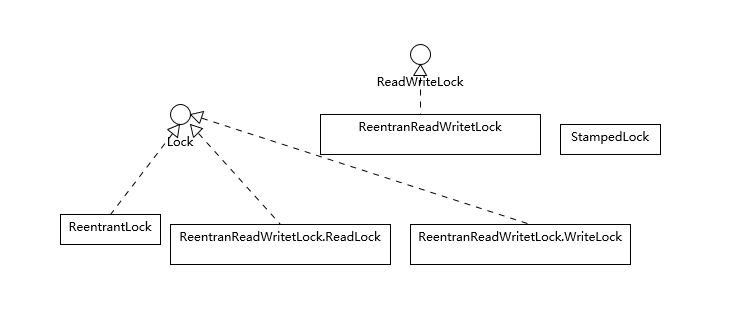
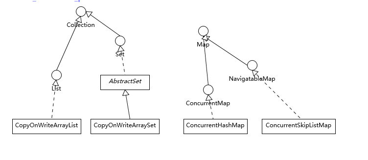
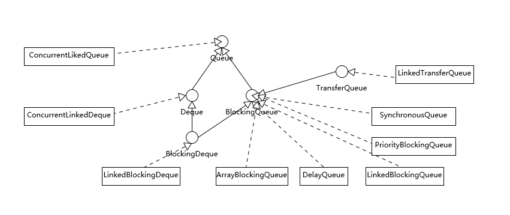
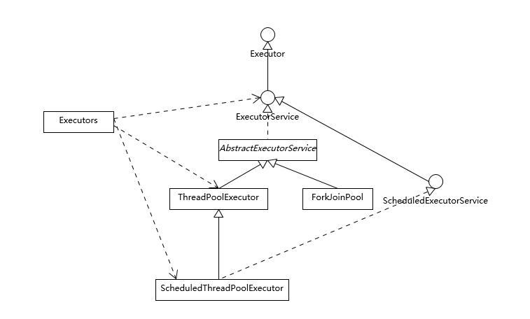
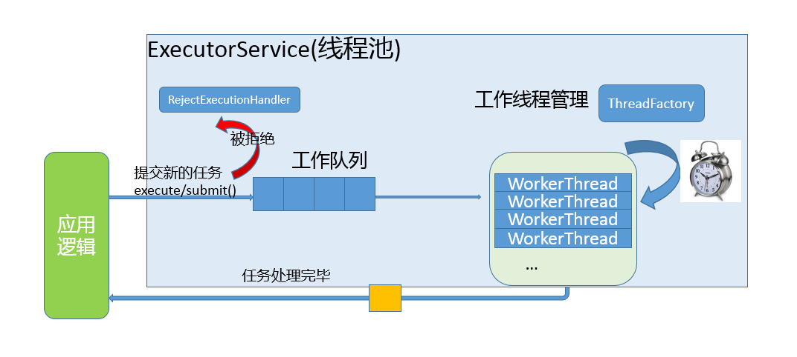
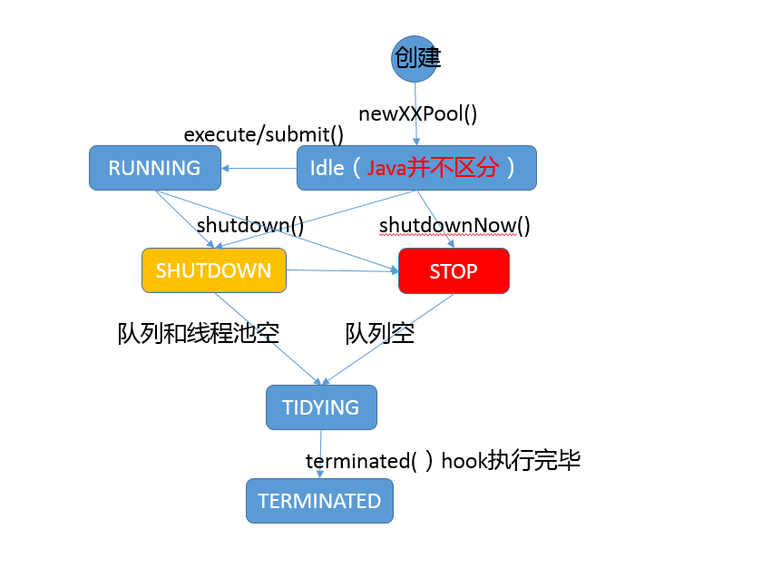
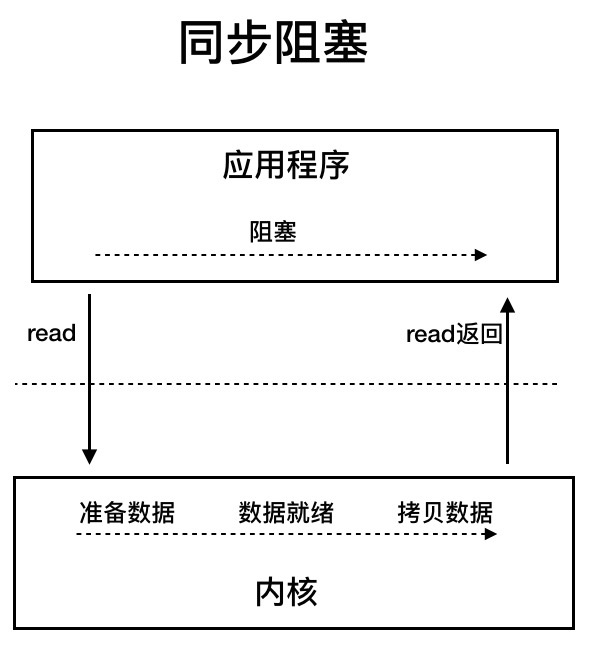
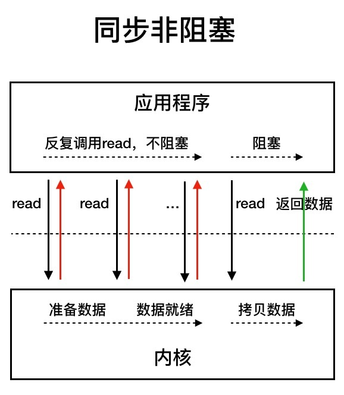
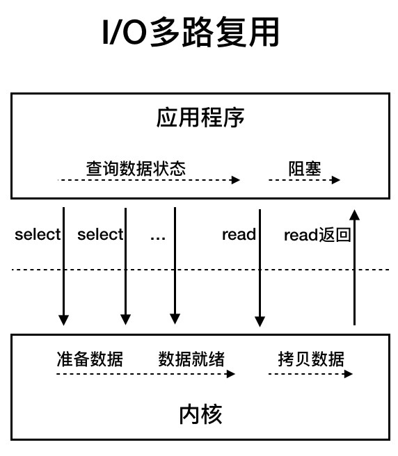
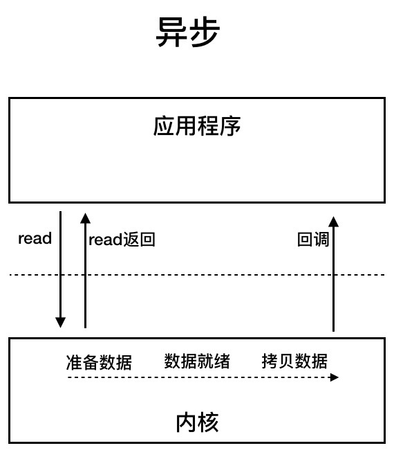

[toc]

 <div style="page-break-after: always;"></div>
# Java并发

## 可见性、原子性和有序性

这同样也是线程安全需要保证的三个特征

1. 可见性
   1. 可见性指的是，当一个线程对一个共享变量进行写入操作，其它线程后续的操作就可以看到这个写入结果
2. 原子性
   1. 对共享变量的更新要么更新成功，要么没有更新，其他线程不会看到只更新一半的结果
   2. **我们把一个或者多个操作在 CPU 执行的过程中不被中断的特性称为原子性**。
3. 有序性
   1. 程序的执行都是按照代码的顺序执行，不会出现乱序的情况
   2. **有序性指的是程序按照代码的先后顺序执行**
      1. 编译器为了优化性能，有时候会改 变程序中语句的先后顺序，例如程序中:“a=6;b=7;”编译器优化后可能变 成“b=7;a=6;”，在这个例子中，编译器调整了语句的顺序，但是不影响程序的最终 结果。

## Java内存模型

java使用内存模型规范来解决在不同平台上的可见性和有序性问题

Java 内存模型规范了 JVM 如何提供按需禁用缓存和编译优化的 方法。具体来说，这些方法包括 **volatile**、**synchronized** 和 **final** 三个关键字，以及六 项 **Happens-Before 规则**。

Happens-Before 规则最初是在一篇叫做**Time, Clocks, and the Ordering of Events in a Distributed System**的论文中提出来的，在这篇论文中，Happens-Before 的语义是一种因果关系。

### happen-before规则

1. 程序的顺序性规则
   1. 在一个线程中，按照程序顺序，前面的操作 Happens-Before 于后续的任意操作。
2. volatile变量规则
   1. 对一个 volatile 变量的写操作， Happens-Before 于后续对这个 volatile变量的读操作。
3. 传递性
   1. 如果 A Happens-Before B，且 B Happens-Before C，那么 A Happens-Before C。
4. 管程中锁的规则
   1. 对一个锁的解锁 Happens-Before 于后续对这个锁的加锁。
   2. **管程**是一种通用的同步原语，在 Java 中指的就是 synchronized，synchronized 是 Java 里对管程的实现。
5. 线程start() 规则
   1. 主线程 A 启动子线程 B 后，子线程 B 能够看到主线程在启动子线程 B 前的操作。
6. 线程join() 规则
   1. 主线程 A 等待子线程 B 完成(主线程 A 通过调用子线程 B 的 join() 方法实现)，当子线程 B 完成后(主线程 A 中 join() 方法返回)，主线程能够看到子线程的操作。当然所谓的“看到”，指的是对**共享变量**的操作。
7. 线程中断规则
   1. 对线程interrupt()方法的调用先行发生于被中断线程的代码检测到中断事件的发生，可以通过Thread.interrupted()方法检测到是否有中断发生。

8. 对象终结规则
   1. 一个对象的初始化完成(构造函数执行结束)先行发生于它的finalize()方法的开始。

## 互斥锁

### synchronized

####使用规则

> 当修饰静态方法的时候，锁定的是当前类的 Class 对象;
> 当修饰非静态方法的时候，锁定的是当前实例对象 this。

#### 底层实现

1. synchronized 代码块是由一对儿 monitorenter/monitorexit 指令实现的，Monitor 对象是同步的基本实现单元。
2. 在 Java 6 之前，Monitor 的实现完全是依靠操作系统内部的互斥锁，因为需要进行用户态 到内核态的切换，所以同步操作是一个无差别的重量级操作。
3. 在java 6之后的实现中，提供了三种不同的Monitor实现，也就是常说的三种不同的锁:偏斜锁(Biased Locking)、轻量级锁和重量级锁， 大大改进了其性能。

#### 锁的升级、降级

1. 所谓锁的升级、降级，就是 JVM 优化 synchronized 运行的机制，当 JVM 检测到不同的 竞争状况时，会自动切换到适合的锁实现，这种切换就是锁的升级、降级
2. 当没有竞争出现时，默认会使用**偏斜锁**。JVM 会利用 CAS 操作(compare and swap)， 在对象头上的 Mark Word 部分设置线程 ID，以表示这个对象偏向于当前线程，所以并不 涉及真正的互斥锁。
   1. 这样做的假设是基于在很多应用场景中，大部分对象生命周期中最多会被一个线程锁定，使用偏斜锁可以降低无竞争开销。
   2. 偏斜锁并不适合所有应用场景，撤销操作(revoke)是比较重的行为，只有当存在较多不 会真正竞争的 synchronized 块儿时，才能体现出明显改善。
   3. 偏斜锁会延缓 JIT 预热的进程，所以很多性能测试中会显式地关闭偏斜锁， 命令如下:
      1. -XX:-UseBiasedLocking
3. 如果有另外的线程试图锁定某个已经被偏斜过的对象，JVM 就需要撤销(revoke)偏斜锁，并切换到**轻量级锁**实现。
   1. 轻量级锁依赖 CAS 操作 Mark Word 来试图获取锁，如果重 试成功，就使用普通的轻量级锁;
4. 进一步升级为**重量级锁**
   1. 重量级锁，就是上面提到的，在java 6之前提供的，使用操作系统互斥锁实现的锁。

###Java类库中提供的其他锁

 

这些锁竟然不都是实现了 Lock 接口，ReadWriteLock 是一个单独的接 口，它通常是代表了一对儿锁，分别对应只读和写操作，标准类库中提供了再入版本的读写 锁实现(ReentrantReadWriteLock)，对应的语义和 ReentrantLock 比较相似。

#### 为什么需要这些锁

这是因为，虽然 ReentrantLock 和 synchronized 简单实用，但是行为上有一定局限性， 通俗点说就是“太霸道”，要么不占，要么独占。实际应用场景中，有的时候不需要大量竞争的写操作，而是以并发读取为主，这个时候就可以使用ReadWriteLock或者其他标准类库中提供的锁。

Java 并发包内的各种同步工具，不仅仅是各种 Lock，其他的如Semaphore、CountDownLatch，甚至是早期的FutureTask等，都是基于一种AQS框架。

####synchronized vs ReentrantLock 

1. synchronized 是 Java 内建的同步机制，所以也有人称其为 Intrinsic Locking，它提供了 互斥的语义和可见性，当一个线程已经获取当前锁时，其他试图获取的线程只能等待或者阻 塞在那里。

2. 在 Java 5 以前，synchronized 是仅有的同步手段，在代码中， synchronized 可以用来 修饰方法，也可以使用在特定的代码块儿上，本质上 synchronized 方法等同于把方法全部 语句用 synchronized 块包起来。

3. ReentrantLock，通常翻译为可重入锁，是 Java 5 提供的锁实现，它的语义和 synchronized 基本相同。可重入锁通过代码直接调用 lock() 方法获取，代码书写也更加灵活。与此同时，ReentrantLock 提供了很多实用的方法，能够实现很多 synchronized 无 法做到的细节控制，比如可以控制 fairness，也就是公平性，或者利用定义条件等。但是， 编码中也需要注意，必须要明确调用 unlock() 方法释放，不然就会一直持有该锁。

   1. ```
      这里所谓的公平性是指在竞争场景中，当公平性为真时，会倾向于将锁赋予等待时间最久的线程。公平性是减少线程“饥饿”(个别线程长期等待锁，但始终无法获取)情况发生的一个办法。
      1. synchronized根本无法进行公平性的选择
      2. 但是公平性也不是那么重要，jvm的平时调度中，很少会出现“饥饿”的情况
      3. 如果要保证公平性，需要引入额外的开销，自然会导致一定的吞吐量下降
      ```

#### 条件变量

1. 如果说 ReentrantLock 是 synchronized 的替代选择，Condition 则是将 wait、notify、notifyAll 等操作转化为 相应的对象，将复杂而晦涩的同步操作转变为直观可控的对象行为。
2. 条件变量最为典型的应用场景就是标准类库中的 ArrayBlockingQueue 等。

###StampedLock

从上面的锁类型可以看出，StampedLock 竟然也是个单独的类型，从类图结构可以看出它是不支持再入性的语义的， 也就是它不是以持有锁的线程为单位。

读写锁看起来比 synchronized 的粒度似乎细一些，但在实际应用中，其表现也并不尽如人意，主要还是因为相对比较大的开销。

所以，JDK 在后期引入了 StampedLock，在提供类似读写锁的同时，还支持优化读模式。 优化读基于假设，大多数情况下读操作并不会和写操作冲突，其逻辑是先试着读，然后通过validate 方法确认是否进入了写模式，如果没有进入，就成功避免了开销;如果进入，则 尝试获取读锁。

```java
public class StampedSample {
    private final StampedLock sl = new StampedLock();

    void mutate() {
        long stamp = sl.writeLock();
        try {
            write();
        } finally {
            sl.unlockWrite(stamp);
        }
    }

    Data access() {
        long stamp = sl.tryOptimisticRead();
        Data data = read();
        if (!sl.validate(stamp)) {
            stamp = sl.readLock();
            try {
                data = read();
            } finally {
                sl.unlockRead(stamp);
            }
        }
        return data;
    }
    // ...
```

StampedLock是对ReadWriteLock的一种优化，那么它和ReadWriteLock有哪些区别呢？

1. ReadWriteLock 支持两种模式:一种是读锁，一种是写锁

2. 而 StampedLock 支持三种模式，分别是: 写锁、悲观读锁和乐观读

   1. 写锁、悲观读锁的语义和 ReadWriteLock 的写锁、读锁的语义非常类似，允许多个线程同时获取悲观读锁，但是只允许一个线程获取写锁，写锁和悲观读锁是互斥的。

   2. **StampedLock 里的写锁和悲观读锁加锁成功之后，都会返回一个 stamp;然后解锁的时候，需要传入这个 stamp。**就如上面的代码所示。注意，**乐观读这个操作 是无锁的**

      ```java
      class Point {
          private int x, y;
          final StampedLock sl = new StampedLock();
          // 计算到原点的距离
          int distanceFromOrigin() {
              // 乐观读
              long stamp = sl.tryOptimisticRead();
              // 读入局部变量
              // 读的过程数据可能被修改
              int curX = x, curY = y;
              // 判断在读操作期间，
              // 是否存在写操作，如果存在,
              // 则sl.validate返回false 
              if (!sl.validate(stamp)) {
                  //升级为悲观读锁
                  stamp = sl.readLock();
                  try {
                      curX = x;
                      curY = y;
                      finally {
                          // 释放悲观读锁
                          sl.unlockRead(stamp);
                      }
                  }
                  return Math.sqrt(
                      curX * curX + curY * curY);
              }
          }
      }
      ```

#### StampedLock注意事项

1. StampedLock 的功能仅仅是 ReadWriteLock 的子集

2. StampedLock 不支持重入

3. StampedLock 的悲观读锁、写锁都不支持条件变量

4. 如果线程阻塞在 StampedLock 的 readLock() 或者 writeLock() 上时，此时调用该阻塞线程的 interrupt() 方法，会导致 CPU 飙升。

   ```java
   final StampedLock lock = new StampedLock();
   Thread T1 = new Thread(() - > {
       // 获取写锁
       lock.writeLock();
       // 永远阻塞在此处，不释放写锁
       LockSupport.park();
   });
   T1.start();
   // 保证T1获取写锁
   Thread.sleep(100);
   Thread T2 = new Thread(() - >
       // 阻塞在悲观读锁
       lock.readLock()
   );
   T2.start();
   // 保证T2阻塞在读锁
   Thread.sleep(100);
   // 中断线程
   // 会导致线程T2所在CPU飙升
   T2.interrupt();
   T2.join();
   ```

   **使用 StampedLock 一定不要调用中断操作，如果需要支持中断功能，一定使用可中断的 悲观读锁 readLockInterruptibly() 和写锁 writeLockInterruptibly()**

### CAS

Atomic 包提供了最常用的原子性数据类型，甚至是引用、数组等相关原子类型和更新操作工具，是很多线程安全程序的首选。

Atomic包提供的LongAdder，在高度竞争环境下，可能就是比 AtomicLong 更佳的选择，尽管它的本 质是空间换时间。

那么在 Java 代码中，我们怎么实现锁操作呢? Unsafe 似乎不是个好的选择，例如，我就注意到类似 Cassandra 等产品，因为 Java 9 中移除了 Unsafe.moniterEnter()/moniterExit()，导致无法平滑升级到新的 JDK 版本。

目前 Java 提供了两种公共 API，可以实现这种 CAS 操作，比如使用 java.util.concurrent.atomic.AtomicLongFieldUpdater，它是基于反射机制创建，我们需要保证类型和字段名称正确。

如果是 Java 9 以后，我们完全可以采用另外一种方式实现，也就是 Variable Handle API，这是源自于JEP 193，提供了各种粒度的原子或者有序性的操作等。我将前面 的代码修改为如下实现:

```java
private static final VarHandle HANDLE = MethodHandles.lookup().findStaticHandle(AtomicBTreePartition.class, "lock");

private void acquireLock() {
    long t = Thread.currentThread().getId();
    while(!HANDLE.compareAndSet(this, 0L, t)) {
        // ...
    }
}
```

#### CAS的不足

1. 使用CAS的前提就是对这个锁的竞争不激烈，在很短的重试之后就能拿到锁；如果在一个竞争激烈的场景下使用CAS，这会导致过度消耗CPU
2. ABA问题
   1. 这个只在lock-free的场景下回出现ABA问题
   2. 针对这种情况，Java 提供了 AtomicStampedReference 工具类，通过为引用建立类似版本号(stamp)的方式，来保证 CAS 的正确性

###AbstractQueuedSynchronizer（AQS）

1. 为什么需要AQS

   1. 从原理上，一种同步结构往往是可以利用其他的结构实现的，但是，对某种同步结构的倾向，会导致复杂、晦涩的实现逻辑，所以，Doug Lea选择了将基础的同步相关操作抽象在 AbstractQueuedSynchronizer 中，利用 AQS 为我们构建同步结构提供了范本。

2. AQS内部数据和方法

   1. 一个 volatile 的整数成员表征状态，同时提供了 setState 和 getState 方法

      ```java
      private volatile int state;
      ```

   2. 一个先入先出(FIFO)的等待线程队列，以实现多线程间竞争和等待，这是 AQS 机制的核心之一。

   3. 各种基于 CAS 的基础操作方法，以及各种期望具体同步结构去实现的 acquire/release 方法。

3. 利用 AQS 实现一个同步结构

   1. 至少要实现`acquire`和`release`操作
   2. 具体实现使用，可以参考`java.util.concurrent.locks.ReentrantLock`

## 并发包中的工具类

1. 比 synchronized 更加高级的各种同步结构
   1. 包括 CountDownLatch、 CyclicBarrier、Semaphore 等，可以实现更加丰富的多线程操作，比如利用Semaphore 作为资源控制器，限制同时进行工作的线程数量。 
2. 各种线程安全的容器
   1. 比如最常见的 ConcurrentHashMap、有序的 ConcunrrentSkipListMap，或者通过类似快照机制，实现线程安全的动态数组 CopyOnWriteArrayList 等。
3. 各种并发队列实现
   1. 如各种 BlockedQueue 实现，比较典型的 ArrayBlockingQueue、 SynchorousQueue 或针对特定场景的 PriorityBlockingQueue 等。
4. 强大的 Executor 框架
   1. 可以创建各种不同类型的线程池，调度任务运行等，绝大部分情 况下，不再需要自己从头实现线程池和任务调度器。

### CountDownLatch

CountDownLatch 是不可以重置的，所以无法重用;而 CyclicBarrier 则没有这种限 制，可以重用。

CountDownLatch 的基本操作组合是 countDown/await。调用 await 的线程阻塞等待 countDown 足够的次数，不管你是在一个线程还是多个线程里 countDown，只要次数 足够即可。所以就像 Brain Goetz 说过的，CountDownLatch 操作的是事件。

### CyclicBarrier

CyclicBarrier 的基本操作组合，则就是 await，当所有的伙伴(parties)都调用了 await，才会继续进行任务，并自动进行重置。**注意**，正常情况下，CyclicBarrier 的重置都是自动发生的，如果我们调用 reset 方法，但还有线程在等待，就会导致等待线程被打扰，抛出 BrokenBarrierException 异常。CyclicBarrier 侧重点是线程，而不是调用事件，它的典型应用场景是用来等待并发线程结束

### ConcurrentLinkedQueue

1. Concurrent 类型基于 lock-free，在常见的多线程访问场景，一般可以提供较高吞吐量。

2. Concurrent 类型没有类似 CopyOnWrite 之类容器相对较重的修改开销。
3. Concurrent 往往提供了较低的遍历一致性
   1. 当利用迭代器遍历时，如果容器发生修改，迭代器仍然可以继续 进行遍历。
   2. size 等操作准确性是有限的，未必是 100% 准确。
4. 与弱一致性对应的，是同步容器常见的行为“fail-fast”
   1. 检测到容器在遍历过程中发生了修改，则抛出 ConcurrentModificationException，不再继续遍历。

### LinkedBlockingQueue

LinkedBlockingQueue 内部则是基于锁，并提供了BlockingQueue 的等待性方法。

## 线程安全的集合

 

###Concurrent容器

如果我们的应用侧重于 Map 放入或者获 取的速度，而不在乎顺序，大多推荐使用 ConcurrentHashMap，反之则使用 ConcurrentSkipListMap;如果我们需要对大量数据进行非常频繁地修改， ConcurrentSkipListMap 也可能表现出优势。

为什么在并发集合中没有TreeMap呢？

这是因为 TreeMap 要实现高效的线程安全是非常困难的，它的实现基于复杂的红黑树。为保证访问效率，当我们插入或删除节点时，会移动节点进行平衡操作，这导致在并发场景中难以进行合理粒度的同步。而 SkipList 结构则要相对简单很多，通过层次结构提高访问速度，虽然不够紧凑，空间使用有一定提高(O(nlogn))，但是在增删元素时线程安全的开销要好很多。为了方便你理解 SkipList的内部结构，我画了一个示意图。

 

### CopyOnWrite容器

任何修改操作，如 add、set、 remove，都会拷贝原数组，修改后替换原来的数组，通过这种防御性的方式，实现另类的线程安全。

这种数据结构，相对比较适合读多写少的操作，不然修改的开销还是非常明显的。

### 线程安全的Queue

 

从行为特征来看，绝大部分 Queue 都是实现了BlockingQueue 接口。在常规队列操作基础上，Blocking 意味着其提供了特定的等待性操作，获取时(take)等待元素进队，或者插入时(put)等待队列出现空位。

#### 队列是否有界

为什么要关注队列的有界性呢，在配合线程池使用的时候非常有用，建议在生产上，配合线程池使用的都用有界队列，这样就不会因为意外而出现OOM的情况，另外对有界队列要加上监控，便于发现系统问题。

1. ArrayBlockingQueue
   1. 有界
   2. 内部以 final 的数组保存数据，数组的大小就决定了队列的边界
   3. ArrayBlockingQueue 实现比较简单，性能更好预测，属于表现稳定的“选手”。
   4. 缺点就是，它需要在创建的时候就获取一个连续的内存空间，初始化内存要求较大，需要针对业务做好评估
2. LinkedBlockingQueue
   1. 有界
   2. 如果我们没有在创建队列时就指定容量，那么其容量限制就自动被 设置为 Integer.MAX_VALUE，成为了无界队列
   3. LinkedBlockingQueue 的吞吐量一般优于 ArrayBlockingQueue，因为它 实现了更加细粒度的锁操作。
3. SynchronousQueue
   1. 容量为0
   2. 每个删除操作都要等待插入操 作，反之每个插入操作也都要等待删除动作
   3. 可能令人意外的是，很多时候 SynchronousQueue 的性能表现，往往大大超过其他实现，尤其是在队列元素较小的场景。
      1. 难怪okhttpClient的同步实现采用的是SynchronousQueue
4. PriorityBlockingQueue
   1. 无界
5. DelayedQueue
   1. 无界
6. LinkedTransferQueue
   1. 无界

## 线程池

1. Future vs FutureTask
2. 对于简单的并行任务，你可以通过“线程池+Future”的方案来 解决;如果任务之间有聚合关系，无论是AND聚合还是OR聚合，都可以通过CompletableFuture来解决;而 批量的并行任务，则可以通过CompletionService来解决

###Executor

Executors 目前提供了 5 种不同的线程池创建配置:

1. newCachedThreadPool
   1. 它是一种用来处理大量短时间工作任务的线程池，具有几个鲜明特点:它会试图缓存线程并重用，当无缓存线程可用时，就会创建新的工作线程;如果线程闲置的时间超过 60 秒，则被终止并移出缓存;长时间闲置时，这种线程池，不会消耗什么资源。其内部使用 SynchronousQueue 作为工作队列。
2. newFixedThreadPool(int nThreads)
   1. 重用指定数目(nThreads)的线程，其背后使用的是**无界的工作队列**，任何时候最多有 nThreads 个工作线程是活动的。这意味着，如果任务数量超过了活动队列数目，将在工作队列中等待空闲线程出现;如果有工作线程退出，将会有新的工作线程被创建，以补足指定的数目 nThreads。
3. newSingleThreadExecutor()
   1. 它的特点在于工作线程数目被限制为 1，操作一个无界的工作队列，所以它保证了所有任务的都是被顺序执行，最多会有一个任务处于活动状态， 并且不允许使用者改动线程池实例，因此可以避免其改变线程数目。
4. newSingleThreadScheduledExecutor() 和 newScheduledThreadPool(int corePoolSize)
   1. 创建的是个 ScheduledExecutorService，可以进行定时或周期性的工作调度，区别在于单一工作线程还是多个工作线程。
5. newWorkStealingPool(int parallelism)
   1. 这是一个经常被人忽略的线程池，Java 8 才加入这个创建方法，其内部会构建ForkJoinPool，利用Work-Stealing算法，并行地处 理任务，不保证处理顺序。

 

###线程池的工作原理

 

线程池的工作线程被抽象为静态内部类 Worker，基于**AQS**实现。

ThreadFactory 提供上面所需要的创建线程逻辑。

如果任务提交时被拒绝，比如线程池已经处于 SHUTDOWN 状态，需要为其提供处理逻辑，Java 标准库提供了类似ThreadPoolExecutor.AbortPolicy等默认实现，也可以按照实际需求自定义。 

###线程池状态转换图

 

### 线程池的构造函数

1. corePoolSize
   1. 所谓的核心线程数，可以大致理解为长期驻留的线程数目(除非设置了 allowCoreThreadTimeOut)。对于不同的线程池，这个值可能会有很大区别，比如 newFixedThreadPool 会将其设置为 nThreads，而对于 newCachedThreadPool 则是 为 0。
2. maximumPoolSize
   1. 顾名思义，就是线程不够时能够创建的最大线程数。同样进行对比，对于 newFixedThreadPool，当然就是 nThreads，因为其要求是固定大小，而 newCachedThreadPool 则是 Integer.MAX_VALUE。
3. keepAliveTime 和 TimeUnit
   1. 这两个参数指定了额外的线程能够闲置多久，显然有些线程池不需要它。
4. workQueue
   1. 工作队列，必须是 BlockingQueue。

### 线程池大小选择

假设CPU核数为N

1. CPU密集型计算
   1. N或者N+1
2. IO密集型计算
   1. Brain Goetz 推荐的计算方法
      1. 线程数 = CPU 核数 × 目标 CPU 利用率 ×(1 + 平均等待时间 / 平均工作时间)

### 线程池中线程的创建时机

当maximumPoolSize和corePoolSize不一致时，线程池中的线程数就可以弹性可伸缩的，那么线程池是在什么时候才创建新的线程呢？

```java
public class ThreadPoolExecutor extends AbstractExecutorService {
  //....
    public void execute(Runnable command) {
        if (command == null)
            throw new NullPointerException();
        /*
         * Proceed in 3 steps:
         *
         * 1. If fewer than corePoolSize threads are running, try to
         * start a new thread with the given command as its first
         * task.  The call to addWorker atomically checks runState and
         * workerCount, and so prevents false alarms that would add
         * threads when it shouldn't, by returning false.
         *
         * 2. If a task can be successfully queued, then we still need
         * to double-check whether we should have added a thread
         * (because existing ones died since last checking) or that
         * the pool shut down since entry into this method. So we
         * recheck state and if necessary roll back the enqueuing if
         * stopped, or start a new thread if there are none.
         *
         * 3. If we cannot queue task, then we try to add a new
         * thread.  If it fails, we know we are shut down or saturated
         * and so reject the task.
         */
        int c = ctl.get();
        if (workerCountOf(c) < corePoolSize) {
            if (addWorker(command, true))
                return;
            c = ctl.get();
        }
        if (isRunning(c) && workQueue.offer(command)) {
            int recheck = ctl.get();
            if (! isRunning(recheck) && remove(command))
                reject(command);
            else if (workerCountOf(recheck) == 0)
                addWorker(null, false);
        }
        else if (!addWorker(command, false))
            reject(command);
    }
```

从这段简短的代码我可以看到，提交的任务是先放到`workQueue`这个队列中的, 如果队列满，这个时候就要添加worker了。所以增加的时机就是跟随线程池队列满的时候增加线程的数目。

注意这里的addWorker函数的第二个参数，是用来表示增加的这个线程是不是corePoolSize中的线程。并不是说线程池中，标记了每个线程到底是coreThread还是新增的Thread。这里的意思是为了维持corePoolSize的数目

在addWorker中有以下的逻辑

```java
            for (;;) {
                int wc = workerCountOf(c);
                if (wc >= CAPACITY ||
                    wc >= (core ? corePoolSize : maximumPoolSize))   // ------> 1
                    return false;
                if (compareAndIncrementWorkerCount(c))
                    break retry;
                c = ctl.get();  // Re-read ctl
                if (runStateOf(c) != rs)
                    continue retry;
                // else CAS failed due to workerCount change; retry inner loop
            }
```

可以看到1处的判断条件，增加需要看你增加的是corePoolSize还是corePoolSize以外的线程。

###线程池中线程的销毁时机

```java
    private Runnable getTask() {
        boolean timedOut = false; // Did the last poll() time out?

        for (;;) {
            int c = ctl.get();
            int rs = runStateOf(c);

            // Check if queue empty only if necessary.
            if (rs >= SHUTDOWN && (rs >= STOP || workQueue.isEmpty())) {
                decrementWorkerCount();
                return null;
            }

            int wc = workerCountOf(c);

            // Are workers subject to culling?
            boolean timed = allowCoreThreadTimeOut || wc > corePoolSize;

            if ((wc > maximumPoolSize || (timed && timedOut))
                && (wc > 1 || workQueue.isEmpty())) {       //  ----------> 3
                if (compareAndDecrementWorkerCount(c))
                    return null;
                continue;
            }

            try {
                Runnable r = timed ?
                    workQueue.poll(keepAliveTime, TimeUnit.NANOSECONDS) :
                    workQueue.take();     //  ----------> 1
                if (r != null)
                    return r;
                timedOut = true;          //  ----------> 2
            } catch (InterruptedException retry) {
                timedOut = false;
            }
        }
    }
```

`getTask`是一个死循环， 我们看第1处的代码，当线程是timed，那么它从blockingQueue中拿任务的时候，就带有预先设置好的超时时间，如果再规定的时间拿不到任务，也就是返回的Runnable是null，那么会在2处把`timedOut`设置为true. 那么在3处，我们就可以去减线程池的worker处了，到了外层函数，线程就会跳出死循环，退出了。

## IO模型

我对这个概念的理解也是经历了很长时间，才有些新的，现在总结一下

主要就是同步和阻塞的理解，同步应该可以看做是从写代码的角度，你再调用这个函数（或者是系统调用）返回之前不能去做其他的事情；而阻塞则可以从操作系统角度来看，就是说当你调用这个函数（或者是系统调用），在它返回之前，你会不会让出CPU，同步阻塞是说，同步调用，在调用成功之前让出了CPU；同步非阻塞是说，同步调用，在调用成功之前没有让出CPU，需要持续不断的去调用该函数，直到成功。

###同步阻塞 



从这个图中可以看到程序在执行read调用的时候是阻塞的，不能做任何事情，在read返回之前，该线程是挂起的，让出CPU的；直到read系统调用返回，程序才继续执行。从操作系统的角度来说，read系统返回，该线程才变成runnable的状态，重新放入CPU的运行队列，等待时间片运行。

### 同步非阻塞



 从上面可以看出，虽然是非阻塞的（也就是read调用完之后立即返回，调用线程在CPU时间片用完之前不会让出CPU），由于内存执行read操作需要时间，所以这个时候调用线程必须采用轮询的方式来查看read的执行情况，如果成功，调用线程被阻塞，等待操作系统把read的数据copy到read所指定的buffer。

### IO多路复用



用户线程的读取操作分成两步了，线程先发起select调用，目的是问内核数据准备好了吗? 等内核把数据准备好了，用户线程再发起read调用。在等待数据从内核空间拷贝到用户空间这段时间里，线程还是阻塞的。那为什么叫I/O多路复用呢?因为一次select调用可以向内核查多个数据通道(Channel)的状 态，所以叫多路复用。

###异步非阻塞



用户线程发起read调用的同时注册一个回调函数，read立即返回，等内核将数据准备好后，再调 用指定的回调函数完成处理。在这个过程中，用户线程一直没有阻塞。

可以看到，调用线程在发起read操作之后，并没有被操作系统阻塞挂起，即使后面也没有等待数据准备好，所有的工作都让操作系统给做了，当数据准备好了，也就是copy到用户指定的buffer里之后，直接调用调用线程之前注册的函数，返回之前的逻辑。

