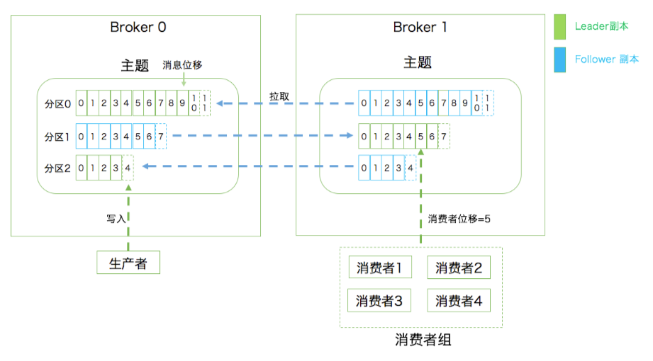
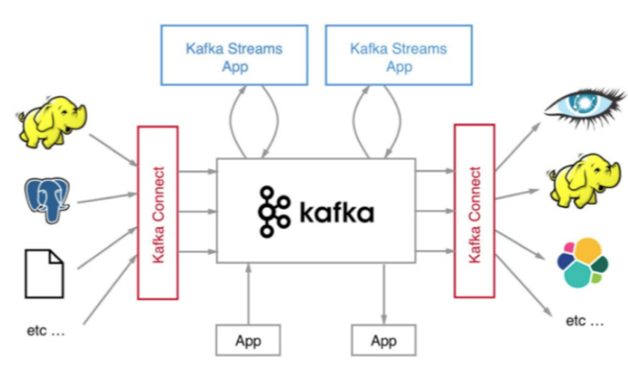
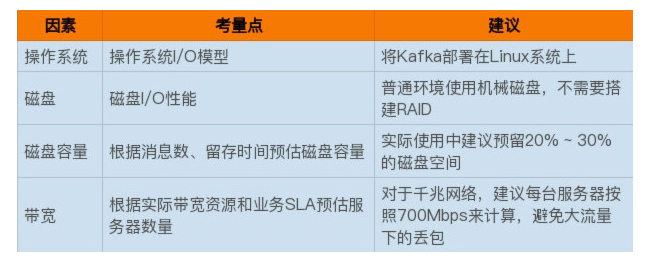

# 概念

 

1. 主题 
   1. 每个主题可以配置 M 个分区，而每个分区又可以配置 N 个副本 
2. 分区
   1. 每个分区的 N 个副本中只能有一个充当领导者角色，对外提供服务
   2. 其他 N-1 个副本是追随者副本，只是提供数据冗余之用 
3. 消息
   1. 分区中包含若干条消息，每条消息的位移从 0 开始，依次递增
   2. 客户端程序只能与分区的领导者副本进行交互
4. Broker
   1. Kafka 的服务器端由被称为 Broker 的服务进程构成
   2. 一个 Kafka 集群由多个 Broker 组成，Broker 负责接收和处理客户端发送过来的请求，以及对消息进行持久化
5. 消费者位移 
   1. Consumer Offset。表征消费者消费进度，每个消费者都有自己的消费者位移。 
6. 消费者组
   1. Consumer Group。多个消费者实例共同组成的一个组，同时消费多个分区以实现高吞吐。
7.  重平衡
   1. Rebalance。消费者组内某个消费者实例挂掉后，其他消费者实例自动重新分配订阅主题分区的过程。Rebalance 是 Kafka 消费者端实现高可用的重要手段。 
8. 高可用
   1. 把broker进程分布到不同的机器上
   2. 备份机制
      1. 把相同的数据拷贝到多台机器上， 这些相同的数据拷贝在 Kafka 中被称为副本(Replica) 
      2. 两类副本
         1. 领导者副本(Leader Replica) 
            1. 对外提供服务，这里的对外指的是与客户端程序进行交互 
         2. 追随者副本(Follower Replica) 
            1. 被动地追随领导者副本而已，**不能与外界进行交互**
      3. 工作机制
         1. 生产者总是向领导者副本写消息
         2. 消费者总是从领导者副本读消息
         3. 追随者副本向领导者副本发送请求，请求领导者把最新生产的消息发给它，这样它能保持与领导者的同步
   3. 副本机制的缺点
      1. 副本机制虽然保证了消息的持久化和消息不丢失，但是没有解决伸缩性问题
         1. 如果领导者副本积累了太多的数据以至于单台 Broker 机器都无法容纳了，此时应该怎么办呢? 
      2. 应对思路
         1. 分区（Partitioning），把一个topic进行多个分区，放到不同的机器上，这样保证了扩展性的同时，也分散了领导者的处理压力。
9. broker数据持久化
   1. Kafka 使用消息日志(Log)来保存数据，一个日志就是磁盘上一个只能追加写(Append-only)消息的物理文件 
   2. 一 个日志又近一步细分成多个日志段（Log Segment），消息被追加写到当前最新的日志段中，当写满了一个日志段后，Kafka 会自动切分出一个新的日志段，并将老的日志段封存起来
   3. Kafka 在后台还有定时任务会定期地检查老的日志段是否能够被删除，从而实现回收磁盘空间的目的 

# Kafka生态

1. Apache Kafka
   1. 最原始的kafka，其他的kafka都是基于它的定制或者叫优化版
   2. 优点
      1. 开发者多
      2. 社区活跃，问题能够得到及时响应
   3. 缺点
      1. Kafka Connect 而言，社区版 Kafka 只提供一种连接器，即读写磁盘文件的连接器，而没有与其他外部系统交互的连接器，在实际使用过程中需要自行编写代码实现
      2. 没有提供任何监控框架或工具, 需要借助第三方的监控工具，我用过的就是burrow了
2. Confluent Kafka
   1. 提供了一些 Apache Kafka 没有的高级特性，比如跨数据中心备份、Schema 注册中心以及集群监控工具等。
   2. 免费版
      1. 免费版还包含 Schema 注册中心和 REST proxy 两大功能
         1. Schema注册中心集中管理 Kafka 消息格式以实现数据前向 / 后向兼容
         2. REST proxy开放 HTTP 接口的方式允许你通过网络访问 Kafka 的各种功能
      2. 免费版包含了更多的连接器
   3. 企业版
      1. 跨数据中心备份
      2. 集群监控
3. Cloudera/Hortonworks Kafka
   1. 这些大数据平台天然集成了 Apache Kafka，通过便捷化的界面操作将 Kafka 的安装、运维、管理、监控全部统一在控制台中。
   2. 弊端在于它的滞后性，一般晚于官方的版本

# 版本选择

1. 0.8.2.0 版本社区引入了新版本 Producer API，即需要指定 Broker 地址的 Producer。
2. 0.8.2.2 这个版本，因为该版本中老版本消费者 API 是比较稳定的。另外即使你升到了 0.8.2.2，也不要使用新版本 Producer API，此时它的 Bug 还非常多。
3. 0.9.0.0, 新版本 Producer API 在这个版本中算比较稳定了, 千万别用 0.9 的新版本 Consumer API
4. 0.10.0.0 是里程碑式的大版本，因为该版本引入了 Kafka Streams
5. 自 0.10.2.2 版本起，新版本 Consumer API 算是比较稳定了
6.  0.11.0.0 版本，引入了两个重量级的功能变更：
   1. 提供幂等性 Producer API 以及事务（Transaction） API
      1. Kafka Streams 在做流处理时无法向批处理那样保证结果的正确性。
   2. 对 Kafka 消息格式做了重构。
      1. 虽然它对用户是透明的，但是它带来的深远影响将一直持续。因为格式变更引起消息格式转换而导致的性能问题在生产环境中屡见不鲜，所以你一定要谨慎对待 0.11 版本的这个变化
7.  0.11.0.3，因为这个版本的消息引擎功能已经非常完善了。
8. 1.0 和 2.0 版本, 主要还是 Kafka Streams 的各种改进，在消息引擎方面并未引入太多的重大功能特性

# 生产部署

