[toc]

# CAP理论

| CAP  | 适用场景                               | 解释                                                         |
| ---- | -------------------------------------- | ------------------------------------------------------------ |
| CA   | 几乎不存在                             | 在分布式系统中，P必然存在，除非适用单机，要提升分区可靠性，需要通过提升基础设施的可靠性实现 |
| CP   | 分布式数据库（Redis、HBase、zk、etcd） | 分布式数据库极端情况下优先保证数据一致性                     |
| AP   | 12306购票、淘宝购物                    | 保证服务可用，购票下单后，一段时候后系统提示余票不足         |

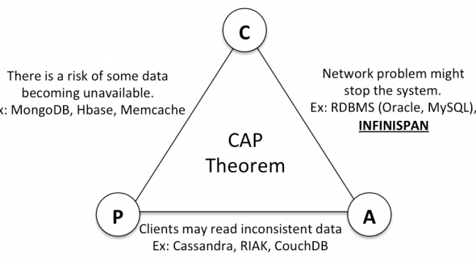

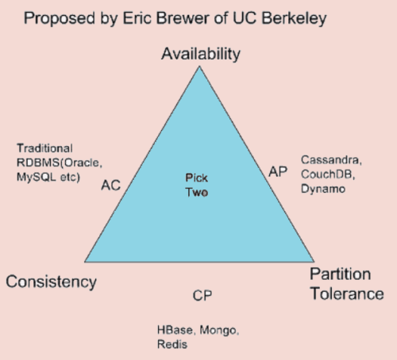

# 分布式互斥

## 什么是分布式互斥

多个进程共同争抢共同的资源，但是只有一个能够获得资源的使用，这就可以叫做分布式互斥（Distributed Mutual Exclusion）。

而这种被互斥访问的共享资源就叫作临界资源(Critical Resource)。

## 集中式方法

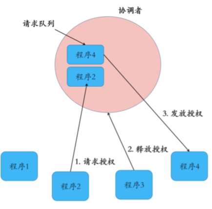

### 算法

1. 引入一个协调者程序 
2. 每个程序在需要访问临界资源时，先给协调者发送一个请求 。
   1. 如果当前没有程序使用这个资源，协调者直接授权请求程序访问 
   2. 否则，按照先来后到的顺序为请求程序排队
   3. 如果有程序使用完资源，则通知协调者，协调者从排队队列中取出相应的请求者并授予访问临界资源的权利

### 消息交互

一个程序完成一次临界资源访问，需要如下几个流程和消息交互: 

1. 向协调者发送请求授权信息，1次消息交互;
2. 协调者向程序发放授权信息，1次消息交互;
3. 程序使用完临界资源后，向协调者发送释放授权，1次消息交互。 

### 优缺点

1. 优点
   1. 算法简单，易于实现
2. 缺点
   1. 协调者会成为系统的性能瓶颈 
   2. 容易引发单点故障问题 

## 分布式方法

### 算法

针对集中式方法的缺点，我们是不是可以不用这个单一的协调者呢？也就是说，当一个程序要访问临界资源时，先向系统中的其他程序发送一条请求消息，在接收到所有程序返回的同意消息后，才可以访问临界资源。其中，请求消息需要包含所请求的资源、请求者的ID，以及发起请求的时间。 

可以从下面的例子看到这个算法的流程

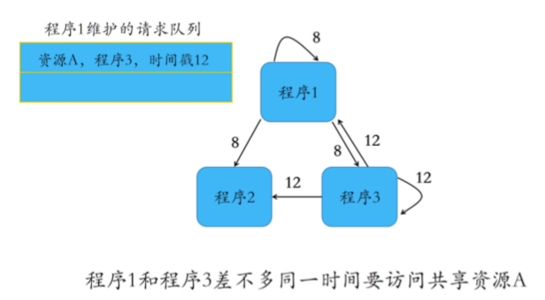

上图中，箭头上面的8， 12代表的时刻，也就是说在时刻8和时刻12，程序1和程序3发起了访问资源A的请求，而程序2在这个过程中没有访问资源A的请求。

注意，这个集群中一共三个进程，如果他们需要访问一个共享资源，需要向该集群中的所有其他进程发送消息。

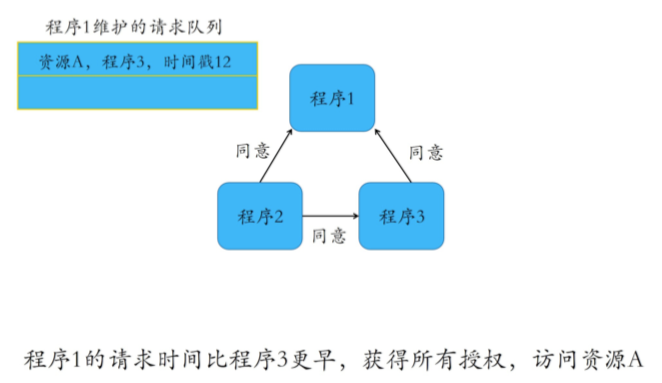

### 消息交互

1. 向其他n-1个程序发送访问临界资源的请求，总共需要n-1次消息交互;
2. 需要接收到其他n-1个程序回复的同意消息，方可访问资源，总共需要n-1次消息交互。 

可以看出，要访问一个临界资源时，需要消息量是非常可观的，当集群的数据增大时，消息量会激增

### 优缺点

1. 缺点
   1. 当系统内需要访问临界资源的程序增多时，容易产生“信令⻛暴”，也就是程序收到的请求完全超过了自己的处理能力，而导致自己正常的业务无法开展。 
   2. 一旦某一程序发生故障，无法发送同意消息，那么其他程序均处在等待回复的状态中，使得整个系统处于停滞状态，导致整个系统不可用。所以，相对于集中式算法的协调者故障，分布式算法的可用性更低。 
2. 改进
   1. 如果检测到一个程序故障，则直接忽略这个程序，无需再等待它的同意消息。 
   2. 但这样的话， 每个程序都需要对其他程序进行故障检测，这无疑带来了更大的复杂性。 

### 应用

1. Hadoop中的HDFS

   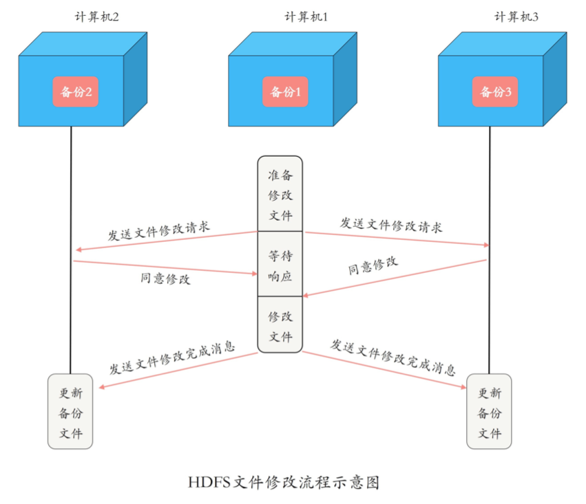

1. 计算机1向计算机2、3发送文件修改请求;
2. 计算机2、3发现自己不需要使用资源，因此同意计算机1的请求; 
3. 计算机1收到其他所有计算机的同意消息后，开始修改该文件; 
4. 计算机1修改完成后，向计算机2、3发送文件修改完成的消息，并发送修改后的文件数据; 
5. 计算机2和3收到计算机1的新文件数据后，更新本地的备份文件。 

从上面的文件修改流程可以看到，虽然HDFS使用多副本来保证的写入数据的高可用性，但是文件的一些写入需要多个副本的同意，写入开销比较大，这也是为什么HDFS默认就是三副本设置的原因吧。如果太多了，写入性能会大幅下降的。

## 令牌环方法

### 算法

所有程序构成一个环结构， 令牌按照顺时针(或逆时针)方向在程序之间传递，收到令牌的程序有权访问临界资源，访问完成后将令牌传送到下一个程序;若该程序不需要访问临界资源，则直接把令牌传送给下一个程序。 

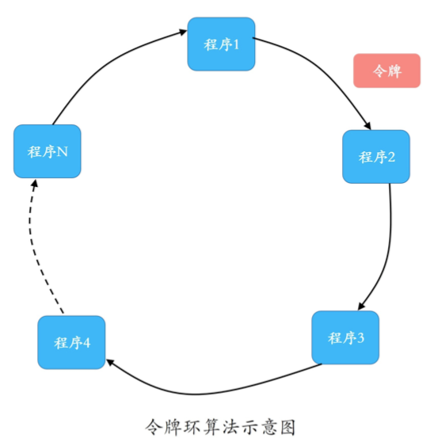

### 优缺点

1. 优点
   1. 在使用临界资源前，不需要像分布式算法那样挨个征求其他程序的意⻅了，所以相对而言，在令牌环算法里单个程序具有更高的通信效率 
   2. 在一个周期内，每个程序都能访问到临界资源，因此令牌环算法的公平性很好。 
2. 缺点
   1. 不管环中的程序是否想要访问资源，都需要接收并传递令牌，所以也会带来一些无效通信。当环中的节点过多时，只有等待令牌到达时才可以进行数据发送，增加了通信延迟，降低了系统的实时性。 （无人机通信中采用了令牌环算法，这个待查）

### 扩展

1. 两层结构的分布式令牌环算法
   1. 广域网由多个局域网组成，因此在该算法中，局域网是较低的层次，广域网是较高的层次。每个局域网中包含若干个局部进程和一个协调进程。局部进程在逻辑上组成一个环形结构，在每个环形结构上有一个局部令牌T在局部进程间传递。局域网与局域网之间通过各自的协调进程进行通信，这些协调进程同样组成一个环结构，这个环就是广域网中的全局环。在这个全局环上，有一个全局令牌在多个协调进程间传递。 

# 分布式选举

## 为什么需要分布式选举

选举的作用就是选出一个主节点，由它来协调和管理其他节点，以保证集群有序运行和节点间数据的一致性。 

1. 主节点，在一个分布式集群中负责对其他节点的协调和管理 
2. 主节点的存在，就可以保证其他节点的有序运行，以及数据库集群中的写入数据在每个节点上的一致性 
   1. 这里的一致性是指，数据在每个集群节点中都是一样的，不存在不同的情况。 

## Bully算法 

### 算法

1. 节点的⻆色有两种:普通节点和主节点 
2. 初始化时，所有节点都是平等的，都是普通节点，并且都有成为主的权利 
3. 当选主成功后，有且仅有一个节点成为主节点，其他所有节点都是普通节点 
4. 当且仅当主节点故障或与其他节点失去联系后，才会重新选主

选举的过程主要如下：

1. 集群中每个节点判断自己的ID是否为当前活着的节点中ID最大的，如果是，则直接向其他节点发送Victory消息，宣誓自己的主权; 
2. 如果自己不是当前活着的节点中ID最大的，则向比自己ID大的所有节点发送Election消息，并等待其他节点的回复; 
3. 若在给定的时间范围内，本节点没有收到其他节点回复的Alive消息，则认为自己成为主节点，并向其他节点发送Victory消息，宣誓自己成为主节点;若接收到来自比自己ID大的节点的Alive消息，则等待其他节点发送Victory消息; 
4. 若本节点收到比自己ID小的节点发送的Election消息，则回复一个Alive消息，告知其他节点，我比你大，重新选举 

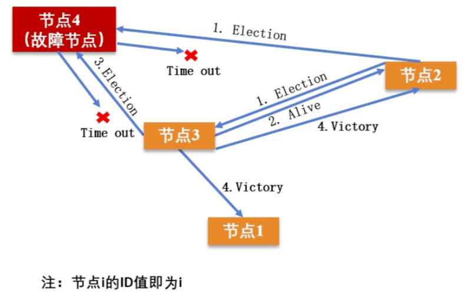

### 应用

1. MongoDB的副本集故障转移功能 
   1. MongoDB的分布式选举中，采用节点的最后操作时间戳来表示ID，时间戳最新的节点其ID最大，也就是说时间戳最新的、活着的节点是主节点。 

### 优缺点

1. 优点
   1. 选举速度快、算法复杂度低、简单易实现 
2. 缺点
   1. 每个节点有全局的节点信息，因此额外信息存储较多 
   2. 任意一个比当前 主节点ID大的新节点或节点故障后恢复加入集群的时候，都可能会触发重新选举，成为新的主节点，如果该 节点频繁退出、加入集群，就会导致频繁切主。 

##Raft算法

### 算法

1. 动画展示

   http://thesecretlivesofdata.com/raft/

2. 过程
   1. 每个节点可以有三种状态
      * Follower
      * Candidate
      * Leader
   
3. leader election
   1. 在系统刚开始的时候，所有的节点都是Follower的状态
   2. 如果follower在一段时间内听不到leader的心跳，则它们自己就会变成Candidate
      1. 每个节点的这个时间是随机的，从150ms到300ms, **election timeout**
   3. 一个节点的超时时间一旦到达，它就把自己变成Candidate，并向其他节点发送vote，vote自己为leader
   4. 如果一个candidate获取了半数的vote，那么它就是新的leader了
   
4. Log Replication
   1. 后面所有的修改都是通过leader的
   2. 每个修改都被append到节点的log中，但是log并没有commit，所以节点的值还不会被更新
   3. leader会把这次修改发送到它的follower节点中
   4. 当有超过半数的节点回复的时候，leader节点就会把这次的修改commit
   5. 之后，leader再向follower发送一个心跳包(发送间隔为 **heartbeat timeout**)，告知commit这个log
   
5. 在四个节点的集群中，如果有两个节点同时成为了candidate，并且也恰好另外两个节点各成为其中一个节点的follower，形成一个2v2的局面，那么这个时候是选不出leader，需要再重新等待一个election timeout重新选举

6. 在一个5个节点（ABCDE,A:leader）的集群中，如果出现了脑裂(AB|CDE)，比如说一个两个节点，一个三节点，原来的主在二节点的网络分区中，那么经过一次选举，三个节点的分区中，会重新选出主来，那么原来5个节点的集群，就有两个master节点了。但是集群的配置还是5，这个时候，只有想那个只有三个节点的分区写入才能写入成功，只有两个节点的那个分区写入永远都不能成功，这是因为，只有两个节点，不能达到集群规模的半数以上，达不成一致。
  
   1. 从服务器角度
      1. leader A向followers发送心跳，但无法获得大多数节点的响应，timeout后，进入选举阶段，AB都无法获得大多数的节点投票
      2. CDE部分，超时后，也进入选举阶段，因为CDE的个数为5节点中的多数，所以可以选出leader对外提供服务；
      3. 当网络恢复后，2节点网络分区，会收到比自己大的election term， 所以要把之前接受到的一些更新回退
   2. 从客户端角度
      1. 客户端使用etcd服务只能通过leader进行
      2. AB分区后，不存在leader，所以无法对外提供服务，之前连接AB节点的客户端将无法获取服务；
      3. 客户端无法感知leader发生变换，它将请求交给AB时，因为AB知道自己不是leader，但同时也不知道leader是谁，所以会向客户端响应轮询节点更换，找到新的leader。

### 应用

1. redis的sentinel

### 优缺点

1. 优点
   1. 选举速度快、算法复杂度低、易于实现 
   2. 该算法选举稳定性比Bully算法好，这是因为当有新节点加入或节点故障恢复后，会触发选主，但不一定会真正切主，除非新节点或故障后恢复的节点获得投票数过半，才会导致切主。 
2. 缺点
   1. 它要求系统内每个节点都可以相互通信，且需要获得过半的投票数才能选主成功，因此通信量大 

## ZAB算法

### 概念

ZAB(ZooKeeper Atomic Broadcast)选举算法是为ZooKeeper实现分布式协调功能而设计的。 针对于Raft算法的改进是，**增加了通过节点ID和数据ID作为参考进行选主**， 节点ID和数据ID越大，表示数据越新，优先成为主。

1. ZAB算法选举中的节点角色
   1. Leader
   2. Follower
   3. Observer

2. 选举过程中的四个状态
   1. Looking状态
      1. 选举状态。当节点处于该状态时，它会认为当前集群中没有Leader，因此自己进入选举状态。
   2. Leading状态
      1. 领导者状态，表示已经选出主，且当前节点为Leader 
   3. Following状态
      1. 跟随者状态，集群中已经选出主后，其他非主节点状态更新为Following，表示对Leader的追随。 
   4. Observing状态
      1. 观察者状态，表示当前节点为Observer，持观望态度，没有投票权和选举权。 
3. 投票过程中的数据结构
   1. 每个节点都有一个唯一的三元组(server_id, server_zxID, epoch) 
      1. server_id表示本节点的唯一ID
      2. server_zxID表示本节点存放的数据ID，数据ID越大表示数据越新，选举权重越大 
      3. epoch表示当前选取轮数，一般用逻辑时钟表示。 
   2. 选举过程中通过(vote_id, vote_zxID)来表明投票给哪个节点
      1. vote_id表示被投票节点的ID 
      2. vote_zxID表示被投票节点的服务器 zxID 

4. ZAB算法选主的原则是:

   **1. server_zxID最大者成为Leader; **

   **2. 若server_zxID相同，则server_id最大者成为Leader** 

### 算法

1. 当系统刚启动时，3个服务器当前投票均为第一轮投票，即epoch=1，且zxID均为0。此时每个服务器都推选自己，并将选票信息<epoch, vote_id, vote_zxID>广播出去。 

   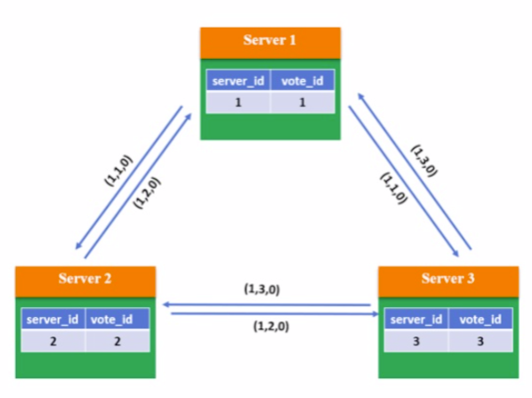

2. 根据判断规则，由于3个Server的epoch、zxID都相同，因此比较server_id，较大者即为推选对象，因此Server 1和Server 2将vote_id改为3，更新自己的投票箱并重新广播自己的投票。 

   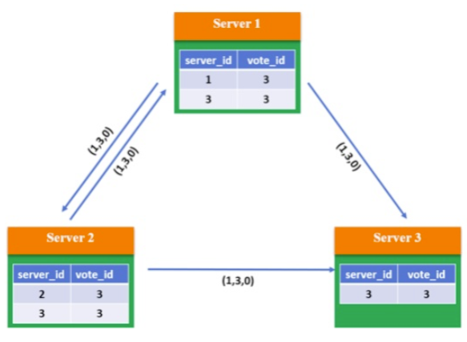

3. 此时系统内所有服务器都推选了Server 3，因此Server 3当选Leader，处于Leading状态，向其他服务器发送心跳包并维护连接;Server1和Server2处于Following状态 

   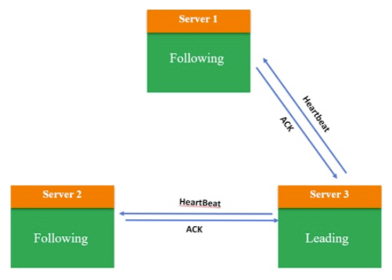

### 优缺点

1. 优点
   1. ZAB算法性能高，对系统无特殊要求 
   2. 稳定性比较好，当有新节点加入或节点故障恢复后，会触发选主，但不一定会真正切主，除非新节点或故障后恢复的节 点数据ID和节点ID最大，且获得投票数过半，才会导致切主。 
2. 缺点
   1. 若节点中有n个节点，每个节点同时广播，则集群中信息量为n*(n-1)个消息，容易出现广播⻛暴 
   2. 除了投票，还增加了对比节点ID和数据ID，这就意味着还需要知道所有节点的ID和数据ID，所以选举时间相对较⻓ 

## Bully、Raft 、ZAB比较

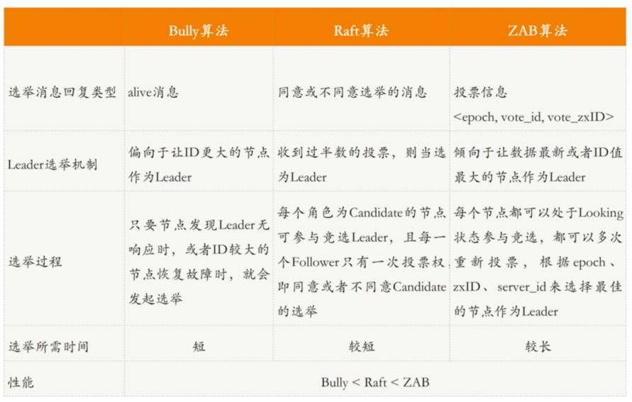

# 分布式结构

## 集中式结构

集中式管理，集中式调度

1. Borg
2. Kubernetes
3. Mesos

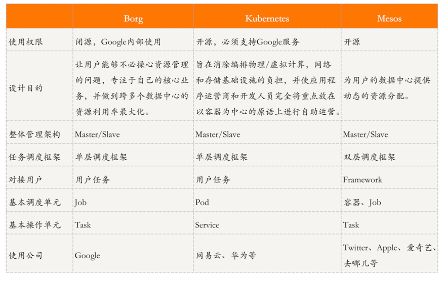

我觉得集中式的管理和调度主要就是简单，易于管理和实现，虽然说使用单台机器会出现单点问题，但是现在这个单点问题可以使用多台机器配合zookeeper或者etcd来解决。

### zookeeper vs etcd3

1. zookeeper

   在CAP理论中，ZK保证了CP。

   一致性协议使用了自己定义的ZAB（Zookeeper Atomic Broadcast）协议，详细见上面的讨论。

   1. pros
      - Non-blocking full snapshots (to make eventually consistent).
      - Efficient memory management.
      - Reliable (has been around for a long time).
      - A simplified API.
      - Automatic ZooKeeper connection management with retries.
      - Complete, well-tested implementations of ZooKeeper recipes.
      - A framework that makes writing new ZooKeeper recipes much easier.
      - Event support through ZooKeeper watches.
      - In a network partition, both minority and majority partitions will start a leader election. Therefore, the minority partition will stop operations. You can read more about this [here](https://loneidealist.wordpress.com/2016/12/26/network-partitioning-in-zookeeper/).
   2. cons
      - Since ZooKeeper is written in Java, it inherits few drawbacks of Java (i.e. garbage collection pauses).
      - When creating snapshots (where the data is written to disks), ZooKeeper read/write operations are halted temporarily. This only happens if we have enabled snapshots. If not, ZooKeeper operates as an in-memory distributed storage.
      - ZooKeeper opens a new socket connection per each new watch request we make. This has made ZooKeepers like more complex since it has to manage a lot of open socket connections in real time.

2. etcd3

   整个的存储结构是key-value的，而不像zookeeper采用树形结构。

   由于采用了Raft协议，所以在CAP理论中，它也是一个CP的系统。

   1. pros

      * Incremental snapshots avoid pauses when creating snapshots, which is a problem in ZooKeeper.
      * No garbage collection pauses due to off-heap storage.
      * Watchers are redesigned, replacing the older event model with one that streams and multiplexes events over key intervals. Therefore, there's no socket connection per watch. Instead, it multiplexes events on the same connection. 
      * Unlike ZooKeeper, etcd can continuously watch from the current revision. There's no need to place another watch once a watch is triggered.
      * etcd3 holds a sliding window to keep old events so that disconnecting will not cause all events to be lost.

   2. cons

      * Note that the client may be uncertain about the status of an operation if it times out or if there's a network disruption between the client and the etcd member. etcd may also abort operations when there is a leader election. etcd does not send abort responses to clients’ outstanding requests in this event.

      * Serialized read requests will continue to be served in a network split where the minority partition is the leader at the time of the split.

        

### zookeeper的CP

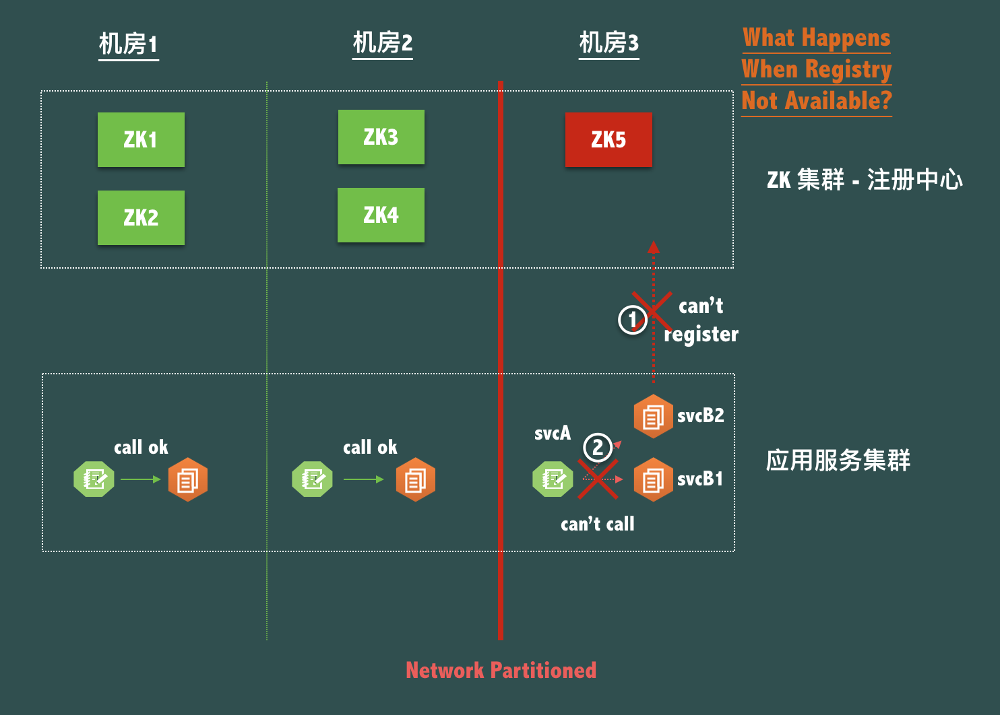

1. 五个zk节点，使用三机房部署
2. 现在假设机房3跟其他两个机房的网路断掉了
3. 这个时候zk5节点是一个不可写入的状态，因为找不到主了
4. 这个时候对于svB（serviceB）来说，它原有的部署结构是不能变的，也就是说，不能发布，重启等。因为发布重启只有要重新进行注册，但是zk5现在是不能写入了，如果出现了发布、重启的操作，新起来的服务是不能注册上去的。
5. 如果发生了svB的重启或者发布，因为注册不上去，svcA是不能调用同机房的svcB的，因为没有注册上去，svcA不知道同机房svcB的存在，自然也就调用不了。**这个就是zk为了保证CP，而牺牲了部分的可用性**

## 分布式结构

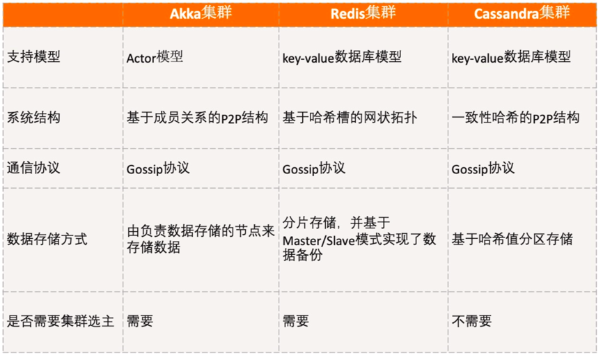

1. Akka这种模式听说过，但是还没有使用过，感觉其实跟go语言中的channel很像，不过go又有基于CSP模型的，难道这两个模型还是有差别的？
   1. 优点就是基于消息传递的变量的不可变性，并发性能好
   2. 缺点也在于很大的对象拷贝消耗，同一个进程内的channel还好，如果不同进程间的，势必会有很多消息传递，这又对网络要求很高，如何保证消息的可靠传输呢？在这一点上，对于应用的设计者要求很高。
2. redis原来没有使用一致性hash，只是简单的在做完hash桶之后就分配到不同的集群节点上了，这里所带来的问题就是如果集群中某个节点挂掉，那么需要重新去获取的key就会很多，造成整个系统的负载突然升高，这个在流量高峰期，有可能会对系统造成毁灭性的打击。当然了，上面说到了，每个集群节点都会有主备的，这在一定程度上缓解了上面的问题。
3. Cassandra采用了一致性hash，如果没有主备的话，应该也会有redis锁面临的同样问题。

