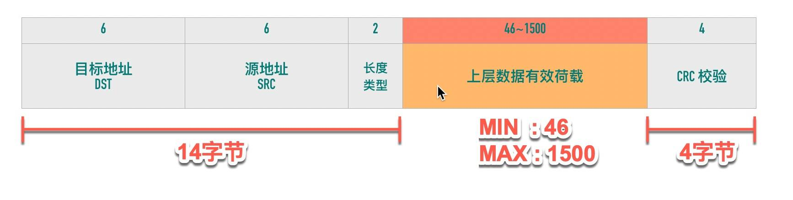

# 深入理解TCP协议

[TOC]

## TCP概述

TCP是一个**可靠的（reliable）**、**面向连接的（connection-oriented）**、**基于字节流（byte-stream）**、**全双工（full-duplex）**的协议。

###面向连接

面向连接的协议要求正式发送数据之前需要通过「握手」建立一个**逻辑**连接，结束通信时也是通过有序的四次挥手来断开连接。

###可靠的

> IP 是一种无连接、不可靠的协议：它尽最大可能将数据报从发送者传输给接收者，但并不保证包到达的顺序会与它们被传输的顺序一致，也不保证包是否重复，甚至都不保证包是否会达到接收者。

TCP是依靠以下几个主要机制在IP层基础上构建了一个可靠的传输层协议：

1. *校验和*

每个 TCP 包首部中都有两字节用来表示校验和，防止在传输过程中有损坏。如果收到一个校验和有差错的报文，TCP 不会发送任何确认直接丢弃它，等待发送端重传。

2. *包的序列号解决乱序、重复*
3. *超时重发*

 TCP 发送数据后会启动一个定时器，等待对端确认收到这个数据包。如果在指定的时间内没有收到 ACK 确认，就会重传数据包，然后等待更长时间，如果还没有收到就再重传，在多次重传仍然失败以后，TCP 会放弃这个包。

4. *流量控制、拥塞控制*

### 面向字节流的协议

TCP 是一种字节流（byte-stream）协议，流的含义是没有固定的报文边界。

假设你调用 2 次 write 函数往 socket 里依次写 500 字节、800 字节。write 函数只是把字节拷贝到内核缓冲区，最终会以多少条报文发送出去是不确定的，这取决于诸多因素：路径最大传输单元 MTU、发送窗口大小、拥塞窗口大小等。

> TCP提供了一种字节流服务，而收发双方都不保持记录的边界，应用程序应该如何提供他们自己的记录标识呢？
>
> 应用程序使用自己约定的规则来表示消息的边界，比如有一些使用回车+换行（"\r\n"），比如 Redis 的通信协议（RESP protocol）。

### 全双工的协议

在 TCP 中发送端和接收端可以是客户端/服务端，也可以是服务器/客户端，通信的双方在任意时刻既可以是接收数据也可以是发送数据，每个方向的数据流都独立管理序列号、滑动窗口大小、MSS 等信息。

## TCP报文头部

TCP头部如下图所示

### 源端口号、目标端口号

TCP 报文头部里没有源 ip 和目标 ip 地址，只有源端口号和目标端口号

### 序列号

TCP 是面向字节流的协议，通过 TCP 传输的字节流的每个字节都分配了序列号，TCP头部的序列号（Sequence number）指的是本报文段第一个字节的序列号。

序列号加上报文的长度，就可以确定传输的是哪一段数据。序列号是一个 32 位的无符号整数，**达到 2^32-1 后循环到 0**。

> 除了在 SYN 报文中，序列号用于交换彼此的初始序列号（Initial Sequence Number, ISN），在其它报文中，序列号用于保证包的顺序。

### 确认号

TCP 使用确认号（Acknowledgment number, ACK）来告知对方下一个期望接收的序列号，小于此确认号的所有字节都已经收到。

> 关于确认号有几个注意点：
>
> - 不是所有的包都需要确认的
> - 不是收到了数据包就立马需要确认的，可以延迟一会再确认
> - **不携带数据**的ACK 包本身不需要被确认，否则就会无穷无尽死循环了
> - 确认号永远是表示小于此确认号的字节都已经收到

###TCP Flags

ACK、FIN、SYN等都是TCP的标记，TCP定义了一个 8 位的字段用来表示 flags，大部分都只用到了后 6 个，我们通常所说的 SYN、ACK、FIN、RST 其实只是把 flags 对应的 bit 位置为 1 而已，这些标记可以组合使用，比如 SYN+ACK，FIN+ACK 等。

> 最常见的标记有下面几个：
>
> - SYN（Synchronize）：用于发起连接数据包同步双方的初始序列号
> - ACK（Acknowledge）：确认数据包，**TCP规定在连接建立后所有传送的报文段都要携带ACK标记**
> - RST（Reset）：这个标记用来强制断开连接，通常是之前建立的连接已经不在了、包不合法、或者实在无能为力处理
> - FIN（Finish）：通知对方我发完了所有数据，准备断开连接，后面我不会再发数据包给你了
> - PSH（Push）：告知对方这些数据包收到以后应该马上交给上层应用，不能缓存起来，当数据是一个独立数据包或者被分成多个数据包(按MSS大小)发送最后一个数据包时会携带PSH标记。

### 窗口大小

最初TCP的窗口大小“Window Size”只有16位，也就是最大65535字节(64KB)，后来引入了「TCP 窗口缩放」选项 作为窗口缩放的比例因子，可以将窗口按比例扩大，例如窗口初始大小为1000，缩放因子为7，则真正的窗口大小为1000*2^7。

### 可选项

TCP头部最后为可选项，格式如下：

> 最常用的选项有以下几个：
>
> - MSS：最大段大小选项，是 TCP 允许的从对方接收的最大报文段
> - SACK：选择确认选项
> - Window Scale：窗口缩放选项

## MTU 和 MSS

### MTU

**数据链路层**传输的帧大小是有限制的，不能把一个太大的包直接塞给链路层，这个限制被称为「**最大传输单元（Maximum Transmission Unit, MTU）**」

以以太网为例，以太网的帧最小的帧是 64 字节，最大的帧是 1518 字节，除去 14 字节头部和 4 字节 CRC，有效荷载最大为 1500，这个值就是以太网的 MTU。因此如果传输 100KB 的数据，至少需要 （100 * 1024 / 1500) = 69 个以太网帧。

> 可以通过netstat -i查看网卡的MTU设置

###IP分段

IPv4 数据报的最大大小为 65535 字节，这已经远远超过了以太网的 MTU，而且有些网络还会开启巨帧（Jumbo Frame）能达到 9000 字节。 当一个 IP 数据包大于 MTU 时，IP 会把数据报文进行切割为多个小的片段(小于 MTU），使得这些小的报文可以通过链路层进行传输。

###MSS

TCP 为了避免被发送方分片，会主动把数据分割成小段再交给网络层，最大的分段大小称之为 **MSS（Max Segment Size）**，也就是TCP层为了IP层不用分片主动将包切割成MSS大小。

> MSS = MTU - IP header头大小 - TCP 头大小
>
> 在以太网中 TCP 的 MSS = 1500（MTU） - 20（IP 头大小） - 20（TCP 头大小）= 1460

## 三次握手

###握手过程

三次握手过程如下图所示：

三次握手的最重要的是交换彼此的 ISN（初始序列号），也就是对彼此的初始序列号达成一致。流程如下：

1. 客户端发送一个SYN报文，这个报文只有SYN标记被置位，不携带数据（TCP Segment Len: 0），但是要传一个序列号，客户端会随机选择一个数字作为初始序列号（ISN）。

> 为什么 SYN 段不携带数据却要消耗一个序列号呢？所谓消耗一个序列号即会使下一个传输的序列号加一
>
> 首先TCP头部的序列号（Sequence number）指的是本报文段第一个字节的序列号，（注意如果没有数据传输，如不携带数据的ACK，虽然TCP头部也有序列号，但是这次传输没有数据，所以下一个实际有数据的传输，会依旧从上一次发送ACK的数据包的序列号开始，如果有数据传输，下一次传输序列号为上一次传输的序列号加上数据长度），但是由于SYN 段需要对方的确认，而ACK机制是通过声明对方流中在这之前的包已经全部收到来进行，所以至少需要消耗一个长度也就是通过ACK=SYN+1确认收到了初始序列号。
>
> 要记住：凡是消耗序列号的 TCP 报文段，一定需要对端确认。如果这个段没有收到确认，会一直重传直到达到指定的次数为止。ACK段可以携带数据也可以不携带数据，如果不携带数据，则不需要对方确认，也不消耗序列号。

2. 服务端收到客户端的SYN段以后，将SYN和ACK标记都置位，SYN 标记的作用与步骤 1 中的一样，也是同步服务端生成的初始序列号。ACK 用来告知发送端之前发送的 SYN 段已经收到了，「确认号」字段指定了发送端下次发送段的序号，这里等于客户端 ISN 加一。 与前面类似 SYN + ACK 端虽然没有携带数据，但是因为 SYN 段需要被确认，所以它也要消耗一个序列号。
3. 客户端发送三次握手最后一个 ACK 段，这个 ACK 段用来确认收到了服务端发送的 SYN 段。因为这个 ACK 段不携带任何数据，且不需要再被确认，这个 ACK 段不消耗任何序列号。

> 初始序列号能设置成一个固定值吗？
>
> 答案是不能，TCP 连接四元组（源 IP、源端口号、目标 IP、目标端口号）唯一确定，所以就算所有的连接 ISN 都是一个固定的值，连接之间也是不会互相干扰的。但是会有以下问题：
>
> 1、出于安全性考虑。如果被知道了连接的ISN，很容易构造一个在对方窗口内的序列号，源 IP 和源端口号都很容易伪造，这样一来就可以伪造 RST 包，将连接强制关闭掉了。
>
> 2、因为开启 SO_REUSEADDR 以后端口允许重用，收到一个包以后不知道新连接的还是旧连接的包因为网络的原因姗姗来迟，造成数据的混淆。
>
> 所以：生成初始序列号的一个建议算法是设计一个假的时钟，每 4 微妙对 ISN 加一，溢出 2^32 以后回到 0，这个算法使得猜测 ISN 变得非常困难。

###半连接队列/全连接队列

当服务端调用 listen 函数时，TCP 的状态被从 CLOSE 状态变为 LISTEN，于此同时内核创建了两个队列：

* 半连接队列（Incomplete connection queue），又称 SYN 队列

- 全连接队列（Completed connection queue），又称 Accept 队列

**半连接对列**

当客户端发起 SYN 到服务端，服务端收到以后会回 ACK 和自己的 SYN。这时服务端这边的 TCP 从 listen 状态变为 SYN_RCVD (SYN Received)，此时会将这个连接信息放入「半连接队列」，半连接队列也被称为 SYN Queue，存储的是 "inbound SYN packets"。

**全连接队列**

「全连接队列」包含了服务端所有完成了三次握手，但是还未被应用取走的连接队列。此时的 socket 处于 ESTABLISHED 状态。每次应用调用 accept() 函数会移除队列头的连接。如果队列为空，accept() 通常会阻塞。全连接队列也被称为 Accept 队列。

>int listen(int sockfd, int backlog)
>
>listen函数的第二个参数backlog用来设置全连接队列大小，如果全连接队列满了，server会舍弃掉client发来的ACK，只有等accept取走连接才可以接收新连接。

**SYN Flood攻击**

SYN Flood 是一种广为人知的 DoS（拒绝服务攻击）,如果客户端大量伪造 IP 发送 SYN 包，服务端回复的 ACK+SYN 去到了一个「未知」的 IP 地址，而未知IP地址不会回复ACK，会造成服务端大量的连接处于 SYN_RCVD 状态，而服务器的半连接队列大小也是有限的，如果半连接队列满，也会出现无法处理正常请求的情况。

>应对SYN Flood攻击的方法：
>
>1. 增加SYN连接数：tcp_max_syn_backlog
>2. 减少SYN+ACK重试次数：tcp_synack_retries
>3. SYN Cookie机制

###TCP Fast Open

TFO 是在原来 TCP 协议上的扩展协议，它的主要原理就在发送第一个 SYN 包的时候就开始传数据了，不过它要求当前客户端之前已经完成过「正常」的三次握手。快速打开分两个阶段：请求 Fast Open Cookie(1-3步骤) 和 真正开始 TCP Fast Open(4-5步骤)。过程如下：

1. 客户端发送一个 SYN 包，头部包含 Fast Open 选项，且该选项的 Cookie 长度为 0

2. 服务端根据客户端 IP 生成 cookie，放在 SYN+ACK 包中一同发回客户端

3. 客户端收到 Cookie 以后缓存在自己的本地内存

4. 客户端再次访问服务端时，在 SYN 包携带数据，并在头部包含 上次缓存在本地的 TCP cookie

5. 如果服务端校验 Cookie 合法，则在客户端回复 ACK 前就可以直接发送数据。如果 Cookie 不合法则按照正常三次握手进行。

   

## 四次挥手

###挥手过程

1. 客户端调用 `close` 方法，执行「主动关闭」，会发送一个 FIN 报文给服务端，从这以后客户端不能再发送数据给服务端了，客户端进入`FIN-WAIT-1`状态。FIN 报文其实就是将 FIN 标志位设置为 1，需要消耗一个序列号。客户端发送 FIN 包以后不能再发送数据给服务端，但是还可以接受服务端发送的数据。这个状态就是所谓的「半关闭（half-close）」。
2. 服务端收到 FIN 包以后回复确认 ACK 报文给客户端，服务端进入 `CLOSE_WAIT`，客户端收到 ACK 以后进入`FIN-WAIT-2`状态。
3. 服务端可以继续发送数据，当没有数据要发送了，发送 FIN 报文给客户端，然后进入`LAST-ACK` 状态，等待客户端的 ACK。
4. 客户端收到服务端的 FIN 报文以后，回复 ACK 报文用来确认第三步里的 FIN 报文，进入`TIME_WAIT`状态，等待 2 个 MSL 以后进入 `CLOSED`状态。服务端收到 ACK 以后进入`CLOSED`状态。

>为什么挥手是四次，不是三次?
>
>其实是可以的，现实中也是存在这种情况，就是服务端收到FIN之后，如果没有数据要发给客户端，可以把ACK和FIN合并成一个包发给客户端，这时四次挥手就变成了三次。
>
>那握手可以变成四次吗？
>
>理论上也是可以的，把三次握手的第二次的 SYN+ACK 拆成先回ACK包，再发 SYN 包，就成了四次握手了，只是SYN包不携带数据，收到客户端SYN包不用等待可以立马回复ACK+SYN。

### TIME_WAIT

首先，我们需要明确，**只有主动断开的那一方才会进入 TIME_WAIT 状态**，且会在这个状态持续 2 个 MSL（Max Segment Lifetime）。

**MSL**

MSL（报文最大生存时间）是 TCP 报文在网络中的最大生存时间，这个值跟IP 报文头中 8 位的存活时间字段（Time to live, TTL）有关，Linux 的套接字实现假设 MSL 为 30 秒，因此在 Linux 机器上 TIME_WAIT 状态将持续 60秒。

**TIME_WAIT存在的原因**

1. 数据报文可能在发送途中延迟但最终会到达，因此要等老的“迷路”的重复报文段在网络中过期失效，这样可以避免用**相同**源端口和目标端口创建新连接时收到旧连接姗姗来迟的数据包，造成数据错乱。
2. 确保可靠实现 TCP 全双工终止连接。关闭连接的四次挥手中，最终的 ACK 由主动关闭方发出，如果这个 ACK 丢失，对端（被动关闭方）将重发 FIN，如果主动关闭方不维持 TIME_WAIT 直接进入 CLOSED 状态，则无法重传 ACK，被动关闭方因此不能及时可靠释放。

> 为什么时间是两个MSL？
>
> - 1 个 MSL 确保四次挥手中主动关闭方最后的 ACK 报文最终能达到对端
> - 1 个 MSL 确保对端没有收到 ACK 重传的 FIN 报文可以到达
>
> 2MSL = 去向 ACK 消息最大存活时间（MSL) + 来向 FIN 消息的最大存活时间（MSL）

**大量TIME_WAIT造成的问题**

- 连接表无法复用： 因为处于 TIME_WAIT 的连接会存活 2MSL（60s），意味着相同的TCP 连接四元组（源端口、源 ip、目标端口、目标 ip）在一分钟之内都没有办法复用，由于机器的端口数量有限（linux为65535），大量的TCP连接进入TIME_WAIT状态会造成无法创建新连接。
- socket 结构体内存占用

**应对TIME_WAIT的办法**

针对 TIME_WAIT 持续时间过长的问题，Linux 新增了两个参数，net.ipv4.tcp_tw_reuse 和 net.ipv4.tcp_tw_recycle，这两个参数都依赖于TCP头部的扩展选项：timestamp。

TCP头部时间戳（TCP Timestamps Option，TSopt）由四部分构成：类别（kind）、长度（Length）、发送方时间戳（TS value）、回显时间戳（TS Echo Reply），占用10个字节，是否使用时间戳选项是在三次握手里面的 SYN 报文里面确定的，并且只有通信两方都开启才有效，之后每个报文都会携带另一方的时间戳和自己的时间戳，而且时间戳是单调递增的值。

1. 当开启 net.ipv4.tcp_tw_reuse 选项时，处于 TIME_WAIT 状态的连接可以被重用, 原理如下：

* 对于“迷路”的重复报文，主动关闭方收到后判断比当前存储的时间戳小，直接丢弃。
* 对于因为ACK包丢失导致被动关闭方（记为B）还处于LAST_ACK状态的连接，如果这时主动关闭方（记为A）发送SYN 包想三次握手建立连接，这个时候处于 `LAST-ACK` 阶段的被动关闭方会回复 FIN，因为这时 A 处于`SYN-SENT`阶段会回以一个 RST 包给 B，B 这端的连接会进入 CLOSED 状态，A 因为没有收到 SYN 包的 ACK，会重传 SYN，后面就一切顺利了。

2. 当开启 net.ipv4.tcp_tw_recycle 选项时，系统会缓存每台主机（即 IP）连接过来的最新的时间戳。对于新来的连接，如果发现 SYN 包中带的时间戳与之前记录的来自同一主机的同一连接的分组所携带的时间戳相比更旧，则直接丢弃。如果更新则接受复用 TIME-WAIT 连接。 **这种方式非常激进，特别是NAT的存在，多个机器会共享相同的出口IP，服务器端看起来是跟同个IP打交道，但是不同客户端携带的timestamp不同，会造成时间戳较小的客户端无法建立连接。**

### RST

RST（Reset）表示复位，用来**异常的**关闭连接，发送RST关闭连接时，不必等缓冲区的数据都发送出去，直接丢弃缓冲区中的数据，连接释放进入`CLOSED`状态。而接收端收到 RST 段后，也不需要发送 ACK 确认（**RST包是不需要确认的**）。

出现RST的几种情况：

1. 端口未监听，比如 web 服务进程挂掉或者未启动，客户端使用 connect 建连，都会出现 "Connection Reset" 或者"Connection refused" 错误。
2. 一方突然断电重启，之前建立的连接信息丢失，另一方并不知道。
3. 调用close函数，设置了SO_LINGER为true，linger设置为0

**Broken pipe 与 Connection reset by peer**（*这两个错误出现的前提都是连接已关闭*）

Broken Pipe是向一个已经收到RST的套接字继续写数据会遇到的。当一个进程向某个已收到 RST 的套接字执行写操作时，内核向该进程发送一个 SIGPIPE 信号。该信号的默认行为是终止进程，因此进程一般会捕获这个信号进行处理。而当是写操作时都将返回 EPIPE 错误（也就Broken pipe 错误）,这也是 Broken pipe 只在写操作中出现的原因。

当从一个已收到RST的套接字读数据的时候会出现Connection reset by peer错误。

### keepalive机制

TCP半开连接：TCP连接的一端异常崩溃，或者在未通知对端的情况下关闭连接（未发送FIN），这种情况下不可以正常收发数据，如果收到数据则会回复RST标志。keepalive机制就是用来检测TCP连接是否存活的机制，通过发送keepalive 包探测连接是否有效。

> Linux下相关参数：
>
> // 多长时间没有数据包交互发送 keepalive 探测包
>  /proc/sys/net/ipv4/tcp_keepalive_time 
>
> // 如果对方没有回应下次探测TCP 包间隔时间
> /proc/sys/net/ipv4/tcp_keepalive_intvl 
>
> // 探测多少次
>  /proc/sys/net/ipv4/tcp_keepalive_probes

现在大部分应用程序都没有开启 keepalive 选项，一个很大的原因就是默认的超时时间太长了，但如果修改这个值到比较小，又违背了 keepalive 的设计初衷（为了检查长时间死连接）。在应用层做连接的有效性检测是一个比较好的实践，也就是我们常说的心跳机制。

##重传机制

前面有介绍到TCP保证可靠连接主要通过校验和保证数据完整、包的序列号解决乱序和重复、超时重传、流量控制、拥塞控制来实现的。其实超时重传只是重传机制中的一种，还有快速重传机制。

### 超时重传

在请求包发出去的时候，开启一个计时器，当计时器达到时间之后，没有收到ACK，则就进行重发请求的操作，一直重发直到达到重发上限次数或者收到ACK。

> **RTO**表示重传超时时间（Retransmission Timeout）意思是如果超过这个时间还没有收到ack就重新发送。这个超时时间在不同的网络的情况下，不是设置一个固定值，只能动态地设置。 为了动态地设置，TCP引入了**RTT**——Round Trip Time，也就是一个数据包从发出去到回来的时间。计算RTO的算法主要有以下几个：
>
> * 经典方法：适用 RTT 波动较小的情况
>
> - 标准方法：对 RTT 波动较大的情况下有更好的适应效果

一旦TCP发送端得到基于时间变化的RTT测量值，就能据此设置RTO，若在设定的RTO内，TCP没有收到计时报文段的ACK，将会触发超时重传。TCP将超时重传视为相当重要的事件，当发生这种情况时，它通过降低当前数据发送率来对此进行快速响应。实现有两种方法：基于拥塞控制机制减小发送窗口大小；每当一个重传报文段被再次重传时，则增大RTO的退避因子。

> 当TCP超时重传时，它并不需要完全重传相同的报文段，TCP允许执行重新组包，发送一个更大的报文段来提高性能(但不能大于接收端通告的MSS和路径MTU)。因为TCP是通过字节号来识别发送和接收的数据的。
>
> 另外如果重传没有回应，会稍后再次重传，重传时间间隔是指数级退避，直到达到 120s 为止，总时间将近 15 分钟，重传次数默认值由 /proc/sys/net/ipv4/tcp_retries2 设置。

### 快速重传

当发送端收到 3 个或以上重复 ACK，就意识到之前发的包可能丢了，于是马上进行重传，不用傻傻的等到超时再重传。

例如有3、4、5、6三个待接收的数据包，先收到了3、5、6，协议栈会马上回复对数据包3的确认，但是不会回复对5、6的确认，而是根据TCP协议的规定，**当接收方收到乱序片段时，需要重复发送ACK**, 在这个地方会发送数据包3的seq+1作为ACK，表明在这个序号之前的报文都收到了，那到底是只重传数据包 4 还是重传 4、5、6 所有包呢？TCP通过选择确认（Selective Acknowledgment, SACK）机制在每一个ACK中包含收到的失序序列的起始序列号和最后一个序列号(加1)，这样发送端就知道只需要重发送数据包4就可以了。

## 流量控制

TCP头里有一个字段叫Window(ACK包会携带上接收窗口的大小win=xxx)，这个字段是接收端告诉发送端自己还有多少缓冲区可以接收数据，于是发送端就可以根据这个窗口来控制发送数据的大小，而不会导致接收端处理不过来，这就是流量控制做的事情。

###滑动窗口

从发送端角度看，数据包的状态可以分为上图的四种：已发送已确认，已发送未确认，即将发送，未发送数据。

**发送窗口**是 TCP 滑动窗口的核心概念，它表示了在某个时刻一端能拥有的最大未确认的数据包大小（最大在途数据），发送窗口是发送端被允许发送的最大数据包大小，其大小等于上图中 #2 区域和 #3 区域加起来的总大小

**可用窗口**是发送端还能发送的最大数据包大小，它等于发送窗口的大小减去在途数据包大小，是发送端还能发送的最大数据包大小，对应于上图中的 #3 号区域

窗口的左边界表示**成功发送并已经被接收方确认的最大字节序号**，窗口的右边界是**发送方当前可以发送的最大字节序号**，滑动窗口的大小等于右边界减去左边界。窗口根据收到的ACK和接收窗口（rwnd）大小判断向右移动多少，实现发送数据的流量控制。

### TCP zero/full window

* TCP zero window

TCP 包中`win=`表示接收窗口的大小，表示接收端还有多少缓冲区可以接收数据，当窗口变成 0 时，表示接收端暂时不能再接收数据了，这时TCP 提供了零窗口探测的机制（Zero window probe），用来向接收端探测，是否可以接收数据。**零窗口探测包**其实就是一个 ACK 包，**一个长度为 0 的 ACK 包，Seq 为当前连接 Seq 最大值减一**。如果发出的探测包一直没有得到回应，发送端会一直重试，重试的策略跟超时重传的机制一样，时间间隔遵循指数级退避。

* TCP full window

TCP Window Full 是站在**发送端**角度说的，表示在途字节数等于对方接收窗口的情况，此时发送端不能再发数据给对方直到发送的数据包得到 ACK。

## 拥塞控制

计算机网络中的带宽、交换结点中的缓存和处理机等，都是网络的资源。在某段时间，若对网络中某一资源的需求超过了该资源所能提供的可用部分，网络的性能就会变坏。这种情况就叫做拥塞。

拥塞控制就是防止过多的数据注入网络中，这样可以使网络中的路由器或链路不致过载。拥塞控制是一个全局性的过程，和流量控制不同，流量控制指点对点通信量的控制。换句话说，拥塞控制跳出了TCP本身，而关注整个网络的通信状况。

主要使用以下四种算法实现拥塞控制：

* 慢启动（Slow Start）；

* 拥塞避免（Congestion Avoidance）；

* 快速重传（Fast Retransmit)；

* 快速恢复（Fast Recovery）；

### 慢启动

每个 TCP 连接都有一个拥塞窗口的限制，最初这个值很小，随着时间的推移，每次发送的数据量如果在不丢包的情况下，“慢慢”的递增，这种机制被称为「慢启动」

> **拥塞窗口(Congestion Window, cwnd)**
>
> 拥塞窗口（cwnd）是**发送端**的限制，是发送端在还未收到对端 ACK 之前还能发送的数据量大小（注意与接收窗口(rwnd)的区别），拥塞窗口初始值等于操作系统的一个变量 initcwnd。
>
> 拥塞窗口跟发送窗口的关系：
>
> 真正的发送窗口大小 = 「接收端接收窗口大小」 与 「发送端自己拥塞窗口大小」 两者的最小值
>
> 如果接收窗口比拥塞窗口小，表示接收端处理能力不够。如果拥塞窗口小于接收窗口，表示接收端处理能力 ok，但网络拥塞。
>
> 发送端和接收端不会交换 cwnd 这个值，这个值是维护在发送端本地内存中的一个值，发送端和接收端最大的在途字节数（未经确认的）数据包大小只能是 rwnd 和 cwnd 的最小值。
>
> **拥塞控制的算法的本质是控制拥塞窗口（cwnd）的变化**

慢启动算法过程：

1. 三次握手以后，双方通过 ACK 告诉了对方自己的接收窗口（rwnd）的大小，之后就可以互相发数据了。
2. 通信双方各自初始化自己的「拥塞窗口」（Congestion Window，cwnd）大小。
3. 第三步，cwnd 初始值较小时，每收到一个 ACK，cwnd + 1，每经过一个 RTT，cwnd 变为之前的两倍。 

为了避免慢启动拥塞窗口（cwnd）无止境的指数级增长，引入了「慢启动阈值」（Slow Start Threshold，ssthresh），当 cwnd < ssthresh 时，拥塞窗口按指数级增长（慢启动），当 cwnd > ssthresh 时，拥塞窗口按线性增长（拥塞避免）。

###拥塞避免

当 cwnd > ssthresh 时，拥塞窗口进入「拥塞避免」阶段，在这个阶段，每一个往返 RTT，拥塞窗口大约增加 1 个 MSS 大小，直到检测到拥塞为止。

### 快速重传

这块内容已在上一节介绍过([戳这里](#fr))。

### 快速恢复

当收到三次重复 ACK 时，进入快速恢复阶段。解释为网络轻度拥塞：

- 拥塞阈值 ssthresh 降低为 cwnd 的一半：ssthresh = cwnd / 2
- 拥塞窗口 cwnd 设置为 ssthresh
- 拥塞窗口线性增加

### 其它减少网络负担方式

Nagle算法和延迟确认的目的都是为了减少网络中传输大量的小报文数，前者是为了减少小于MSS的数据包的传输，后者是减少ACK报文的单独传输。

* ***Nagle算法***

Nagle 算法要求，当一个 TCP 连接中有在传数据（已经发出但还未确认的数据）时，小于 MSS 的报文段就不能被发送，直到所有的在传数据都收到了 ACK。同时收到 ACK 后，TCP 还不会马上就发送数据，会收集小包合并一起发送。

Nagle算法的规则（可参考tcp_output.c文件里tcp_nagle_check函数注释）：

（1）如果包长度达到MSS，则允许发送；

（2）如果该包含有FIN，则允许发送；

（3）设置了TCP_NODELAY选项，则允许发送；

（4）未设置TCP_CORK选项时，***若所有发出去的小数据包（包长度小于MSS）均被确认，则允许发送；***

（5）上述条件都未满足，但发生了超时（一般为200ms），则立即发送。

> 不过 Nagle 算法是时代的产物，可能会导致较多的性能问题，有可能引入明显的延迟，尤其是与延迟确认一起使用的时候，很多组件为了高性能都默认禁用掉了这个特性

* ***延迟确认***

如果收到一个数据包以后暂时没有数据要分给对端，它可以等一段时间（Linux 上是 40ms）再确认。如果这段时间刚好有数据要传给对端，ACK 就可以随着数据一起发出去了。如果超过时间还没有数据要发送，也发送 ACK，以免对端以为丢包了。这种方式成为「延迟确认」。

TCP 要求 ACK 延迟的时延必须小于500ms，一般操作系统实现都不会超过200ms，延迟确认在很多 linux 机器上是没有办法关闭的。

Nagle 攒着包一次发一个，延迟确认收到包不马上回。所以当两者一起使用时就会引起重要的性能问题。

##常用工具/命令

### telnet

* 检查端口号是否打开

> telnet [domainname or ip] [port]

### netcat

输入命令时可以直接使用nc，被称为网络工具中的瑞士军刀，它能通过TCP和UDP在网络中读写数据。通过与其他工具结合和重定向，所能完成的事情令人惊讶。

**netcat**所做的就是在两台电脑之间建立链接并返回两个数据流，在这之后所能做的事就看你的想像力了。你能建立一个服务器，传输文件，与朋友聊天，传输流媒体或者用它作为其它协议的独立客户端

### netstat

查看套接字信息

-a：列出所有套接字，包括所有状态的套接字；

-t：只列出TCP的套接字；

-l：只列出LISTEN状态的连接；

-n：禁止常用端口映射为名字，例如ss端口显示为ssh

-p：显示连接归属的进程

上面参数可组合使用，通常会使用-atnp，例如显示8080端口的TCP连接：

> netstat -atnp | grep ":8080"

### tcpdump

* 基本参数

-i：表示指定哪一个网卡，一般使用any，表示任意；

-n：禁用主机解析，显示IP而非主机名；-nn：禁用主机和端口解析；

-A：用ASCII格式查看包体内容；-X：同时用 HEX 和 ASCII 显示报文内容;

-w：输出到文件，格式.pcap， 例如 `tcpdump -i any port 80 -w test.pcap`

-S：默认情况下，tcpdump 显示的是从 0 开始的相对序号。如果想查看真正的绝对序号，可以用 -S 选项。

[host xxx.xxx.xxx.xxx]：过滤源地址或目标地址为host的包；

[src xxx.xxx.xxx.xxx]：过滤源地址为src的包；

[dst xxx.xxx.xxx.xxx]：过滤目标地址为dst的包；

[port xxx]：过滤端口为port的包，包括收到和发出的，如果只想看收到的包，使用dst port xx；

* 高级使用

tcpdump 真正强大的是可以用布尔运算符`and`（或`&&`）、`or`（或`||`）、not（或`!`）来组合出任意复杂的过滤器，

例如：抓取 ip 为 10.211.55.10 到端口 3306 的数据包 `tcpdump -i any host 10.211.55.10 and dst port 3306`

* 输出解读

   S：SYN标志；F：FIN 标志；R：RST 标志；P：PSH 标志；U：URG 标志；. ：没有标志，ACK 情况下使用

### wireshark

自行百度怎么使用，以及怎么进行过滤

注意，每个包的协议分层从上往下依次是：

- Frame：物理层的数据帧
- Ethernet II：数据链路层以太网帧头部信息
- Internet Protocol Version 4：互联网层IP包头部信息
- Transmission Control Protocol：传输层的数据段头部信息，此处是TCP协议
- Hypertext Transfer Protocol：应用层 HTTP 的信息