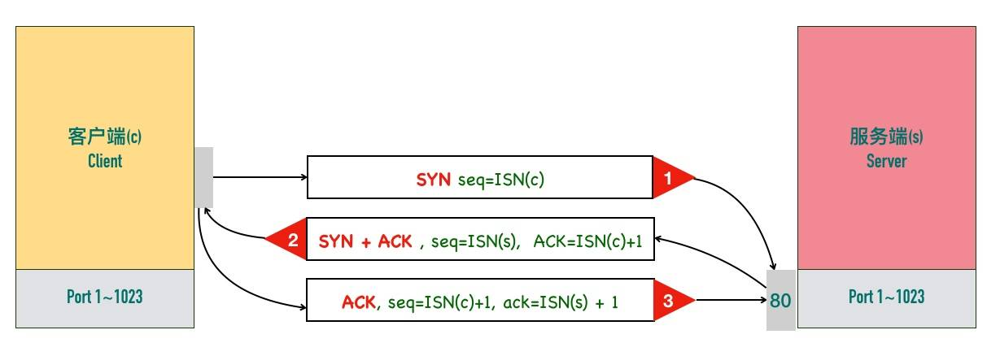

# 深入理解TCP协议

[TOC]

## TCP概述

TCP是一个**可靠的（reliable）**、**面向连接的（connection-oriented）**、**基于字节流（byte-stream）**、**全双工（full-duplex）**的协议。

###面向连接

面向连接的协议要求正式发送数据之前需要通过「握手」建立一个**逻辑**连接，结束通信时也是通过有序的四次挥手来断开连接。

###可靠的

> IP 是一种无连接、不可靠的协议：它尽最大可能将数据报从发送者传输给接收者，但并不保证包到达的顺序会与它们被传输的顺序一致，也不保证包是否重复，甚至都不保证包是否会达到接收者。

TCP是依靠以下几个主要机制在IP层基础上构建了一个可靠的传输层协议：

1. *校验和*

每个 TCP 包首部中都有两字节用来表示校验和，防止在传输过程中有损坏。如果收到一个校验和有差错的报文，TCP 不会发送任何确认直接丢弃它，等待发送端重传。

2. *包的序列号解决乱序、重复*
3. *超时重发*

 TCP 发送数据后会启动一个定时器，等待对端确认收到这个数据包。如果在指定的时间内没有收到 ACK 确认，就会重传数据包，然后等待更长时间，如果还没有收到就再重传，在多次重传仍然失败以后，TCP 会放弃这个包。

4. *流量控制、拥塞控制*

### 面向字节流的协议

TCP 是一种字节流（byte-stream）协议，流的含义是没有固定的报文边界。

假设你调用 2 次 write 函数往 socket 里依次写 500 字节、800 字节。write 函数只是把字节拷贝到内核缓冲区，最终会以多少条报文发送出去是不确定的，这取决于诸多因素：路径最大传输单元 MTU、发送窗口大小、拥塞窗口大小等。

> TCP提供了一种字节流服务，而收发双方都不保持记录的边界，应用程序应该如何提供他们自己的记录标识呢？
>
> 应用程序使用自己约定的规则来表示消息的边界，比如有一些使用回车+换行（"\r\n"），比如 Redis 的通信协议（RESP protocol）。

### 全双工的协议

在 TCP 中发送端和接收端可以是客户端/服务端，也可以是服务器/客户端，通信的双方在任意时刻既可以是接收数据也可以是发送数据，每个方向的数据流都独立管理序列号、滑动窗口大小、MSS 等信息。

## TCP报文头部

TCP头部如下图所示

### 源端口号、目标端口号

TCP 报文头部里没有源 ip 和目标 ip 地址，只有源端口号和目标端口号

### 序列号

TCP 是面向字节流的协议，通过 TCP 传输的字节流的每个字节都分配了序列号，TCP头部的序列号（Sequence number）指的是本报文段第一个字节的序列号。

序列号加上报文的长度，就可以确定传输的是哪一段数据。序列号是一个 32 位的无符号整数，**达到 2^32-1 后循环到 0**。

> 除了在 SYN 报文中，序列号用于交换彼此的初始序列号（Initial Sequence Number, ISN），在其它报文中，序列号用于保证包的顺序。

### 确认号

TCP 使用确认号（Acknowledgment number, ACK）来告知对方下一个期望接收的序列号，小于此确认号的所有字节都已经收到。

> 关于确认号有几个注意点：
>
> - 不是所有的包都需要确认的
> - 不是收到了数据包就立马需要确认的，可以延迟一会再确认
> - **不携带数据**的ACK 包本身不需要被确认，否则就会无穷无尽死循环了
> - 确认号永远是表示小于此确认号的字节都已经收到

###TCP Flags

ACK、FIN、SYN等都是TCP的标记，TCP定义了一个 8 位的字段用来表示 flags，大部分都只用到了后 6 个，我们通常所说的 SYN、ACK、FIN、RST 其实只是把 flags 对应的 bit 位置为 1 而已，这些标记可以组合使用，比如 SYN+ACK，FIN+ACK 等。

> 最常见的标记有下面几个：
>
> - SYN（Synchronize）：用于发起连接数据包同步双方的初始序列号
> - ACK（Acknowledge）：确认数据包
> - RST（Reset）：这个标记用来强制断开连接，通常是之前建立的连接已经不在了、包不合法、或者实在无能为力处理
> - FIN（Finish）：通知对方我发完了所有数据，准备断开连接，后面我不会再发数据包给你了。
> - PSH（Push）：告知对方这些数据包收到以后应该马上交给上层应用，不能缓存起来

### 窗口大小

最初TCP的窗口大小“Window Size”只有16位，也就是最大65535字节(64KB)，后来引入了「TCP 窗口缩放」选项 作为窗口缩放的比例因子，可以将窗口按比例扩大，例如窗口初始大小为1000，缩放因子为7，则真正的窗口大小为1000*2^7。

### 可选项

TCP头部最后为可选项，格式如下：

> 最常用的选项有以下几个：
>
> - MSS：最大段大小选项，是 TCP 允许的从对方接收的最大报文段
> - SACK：选择确认选项
> - Window Scale：窗口缩放选项

## MTU 和 MSS

### MTU

**数据链路层**传输的帧大小是有限制的，不能把一个太大的包直接塞给链路层，这个限制被称为「**最大传输单元（Maximum Transmission Unit, MTU）**」

以以太网为例，以太网的帧最小的帧是 64 字节，最大的帧是 1518 字节，除去 14 字节头部和 4 字节 CRC，有效荷载最大为 1500，这个值就是以太网的 MTU。因此如果传输 100KB 的数据，至少需要 （100 * 1024 / 1500) = 69 个以太网帧。

> 可以通过netstat -i查看网卡的MTU设置

###IP分段

IPv4 数据报的最大大小为 65535 字节，这已经远远超过了以太网的 MTU，而且有些网络还会开启巨帧（Jumbo Frame）能达到 9000 字节。 当一个 IP 数据包大于 MTU 时，IP 会把数据报文进行切割为多个小的片段(小于 MTU），使得这些小的报文可以通过链路层进行传输。

###MSS

TCP 为了避免被发送方分片，会主动把数据分割成小段再交给网络层，最大的分段大小称之为 **MSS（Max Segment Size）**，也就是TCP层为了IP层不用分片主动将包切割成MSS大小。

> MSS = MTU - IP header头大小 - TCP 头大小
>
> 在以太网中 TCP 的 MSS = 1500（MTU） - 20（IP 头大小） - 20（TCP 头大小）= 1460

## 三次握手

三次握手过程如下图所示：

三次握手的最重要的是交换彼此的 ISN（初始序列号），也就是对彼此的初始序列号达成一致。流程如下：

1. 客户端发送一个SYN报文，这个报文只有SYN标记被置位，不携带数据（TCP Segment Len: 0），但是要传一个序列号，客户端会随机选择一个数字作为初始序列号（ISN）。

> 为什么 SYN 段不携带数据却要消耗一个序列号呢？所谓消耗一个序列号即会使下一个传输的序列号加一
>
> 首先TCP头部的序列号（Sequence number）指的是本报文段第一个字节的序列号，（注意如果没有数据传输，如不携带数据的ACK，虽然TCP头部也有序列号，但是这次传输没有数据，所以下一个实际有数据的传输，会依旧从上一次发送ACK的数据包的序列号开始，如果有数据传输，下一次传输序列号为上一次传输的序列号加上数据长度），但是由于SYN 段需要对方的确认，而ACK机制是通过声明对方流中多大长度的字节已经收到来进行，所以至少需要消耗一个长度也就是通过ACK=SYN+1确认收到了初始序列号。
>
> 要记住：凡是消耗序列号的 TCP 报文段，一定需要对端确认。如果这个段没有收到确认，会一直重传直到达到指定的次数为止。ACK段可以携带数据也可以不携带数据，如果不携带数据，则不需要对方确认，也不消耗序列号。

2. 服务端收到客户端的SYN段以后，将SYN和ACK标记都置位，SYN 标记的作用与步骤 1 中的一样，也是同步服务端生成的初始序列号。ACK 用来告知发送端之前发送的 SYN 段已经收到了，「确认号」字段指定了发送端下次发送段的序号，这里等于客户端 ISN 加一。 与前面类似 SYN + ACK 端虽然没有携带数据，但是因为 SYN 段需要被确认，所以它也要消耗一个序列号。
3. 客户端发送三次握手最后一个 ACK 段，这个 ACK 段用来确认收到了服务端发送的 SYN 段。因为这个 ACK 段不携带任何数据，且不需要再被确认，这个 ACK 段不消耗任何序列号。

> 初始序列号能设置成一个固定值吗？
>
> 答案是不能，TCP 连接四元组（源 IP、源端口号、目标 IP、目标端口号）唯一确定，所以就算所有的连接 ISN 都是一个固定的值，连接之间也是不会互相干扰的。但是会有以下问题：
>
> 1、出于安全性考虑。如果被知道了连接的ISN，很容易构造一个在对方窗口内的序列号，源 IP 和源端口号都很容易伪造，这样一来就可以伪造 RST 包，将连接强制关闭掉了。
>
> 2、因为开启 SO_REUSEADDR 以后端口允许重用，收到一个包以后不知道新连接的还是旧连接的包因为网络的原因姗姗来迟，造成数据的混淆。
>
> 所以：生成初始序列号的一个建议算法是设计一个假的时钟，每 4 微妙对 ISN 加一，溢出 2^32 以后回到 0，这个算法使得猜测 ISN 变得非常困难。

